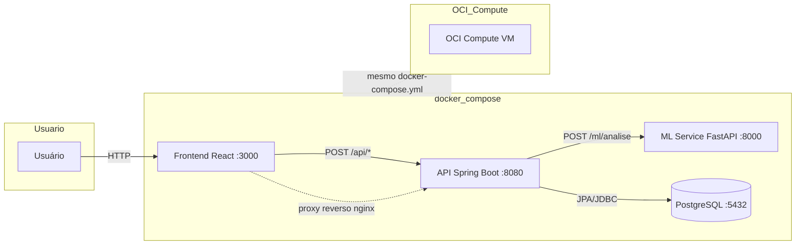

# Nidus


## Sobre

Sistema de análise de comportamento financeiro com classificação de transações, perfil financeiro e recomendações personalizadas.

### Arquitetura da Solução



---

## Descrição do projeto 

Criar uma solução inteligente capaz de analisar o comportamento financeiro de um usuário a partir de suas transações e informações financeiras, gerando uma visão mais completa da sua saúde financeira. 
A solução deverá receber informações relacionadas a gastos e hábitos financeiros, como descrição de transações, valores, categorias de despesas, renda mensal, frequência de economia, nível de endividamento e outros indicadores relevantes. 
Com base nesses dados, o sistema deverá ser capaz de: 
* Classificar automaticamente despesas em categorias financeiras; 
* Identificar padrões de consumo; 
* Classificar o perfil financeiro do usuário; 
* Gerar indicadores que auxiliem na compreensão dos hábitos financeiros; 
* Apresentar recomendações simples para melhoria da saúde financeira. 
 
Esse tipo de solução pode ser utilizado por aplicativos financeiros, carteiras digitais, plataformas de educação financeira ou por usuários que desejam organizar melhor suas finanças pessoais. 
A solução deverá retornar os resultados em formato JSON e utilizar serviços OCI para armazenamento, processamento ou implantação da aplicação. 

---

## Necessidade do cliente 

Muitas pessoas possuem acesso aos dados das suas transações, mas têm dificuldade em transformar essas informações em conhecimento útil para tomada de decisão. 

A solução deve permitir: 
* Organizar automaticamente despesas e receitas; 
* Entender para onde o dinheiro está sendo direcionado; 
* Identificar hábitos financeiros positivos ou de risco; 
* Receber recomendações simples de melhoria; 
* Acompanhar a evolução do comportamento financeiro ao longo do tempo. 

Essa abordagem transforma dados financeiros brutos em informações claras e acionáveis. 

---

## Validação de mercado 

O mercado de fintechs, bancos digitais e plataformas de educação financeira continua em expansão. 

Os usuários buscam ferramentas que permitam: 
* Automatizar o controle financeiro; 
* Entender padrões de consumo; 
* Melhorar a capacidade de planejamento; 
* Reduzir riscos financeiros; 
* Receber recomendações personalizadas. 

Soluções que unem análise de gastos e avaliação de perfil financeiro geram mais valor do que classificadores isolados, pois oferecem uma visão mais ampla do comportamento do usuário. 

---

## Objetivo do Hackathon 

Desenvolver um MVP funcional capaz de: 
* Classificar despesas financeiras automaticamente; 
* Analisar o comportamento financeiro do usuário; 
* Gerar uma classificação de perfil financeiro; 
* Apresentar recomendações personalizadas; 
* Disponibilizar os resultados por meio de uma API REST; 
* Utilizar pelo menos um serviço OCI como parte da arquitetura da solução. 
 
---

## Resultados esperados 

### Ciência de Dados 
Notebook contendo: 
* Exploração e limpeza dos dados (EDA); 
* Tratamento de variáveis financeiras e textuais; 
* Engenharia de atributos; 
* Classificação de despesas; 
* Análise de perfil financeiro; 
* Treinamento e avaliação de modelos; 
* Métricas de desempenho adequadas; 
* Serialização dos modelos. 

### Back-End 
API REST contendo: 
* Endpoint para análise financeira (`POST /analise-financeira`); 
* Endpoint para classificação de transações (`POST /classificacao-transacoes`); 
* Endpoint para histórico de análises (`GET /historico-analises`); 
* Validação de entrada; 
* Tratamento de erros com códigos padronizados; 
* Documentação dos endpoints. 

### OCI
O edital do hackathon sugere os seguintes serviços OCI (a equipe deve utilizar pelo menos um): 
* Object Storage para armazenamento de modelos ou dados; 
* OCI Compute para hospedagem da aplicação; 
* OCI Functions para processamento específico; 
* Banco de dados opcional para persistência de informações. 

O projeto utiliza o **OCI Compute** como serviço OCI obrigatório. O mesmo `docker-compose.yml` usado em desenvolvimento é executado na VM da OCI sem qualquer alteração de código, ambiente ou dependência externa.
 
---

## Funcionalidades obrigatórias (MVP) 

### Classificação de transações 
O sistema deverá ser capaz de classificar automaticamente despesas em categorias como: 
* Alimentação; 
* Transporte; 
* Saúde; 
* Moradia; 
* Educação; 
* Lazer; 
* Serviços; 
* Outras categorias definidas pela equipe. 

### Análise de perfil financeiro 
O sistema deverá gerar uma avaliação do perfil financeiro do usuário com base nos dados analisados. 
Exemplos de categorias: 
* Saudável; 
* Em observação; 
* Em risco. 

As categorias podem ser adaptadas pela equipe conforme a estratégia adotada. 

### Recomendações financeiras 
A solução deverá gerar recomendações simples e objetivas com base nos resultados obtidos. 
Exemplos: 
* Reduzir gastos em determinada categoria; 
* Aumentar frequência de poupança; 
* Melhorar controle de despesas recorrentes. 
 
---

## Exemplo de uso 

### Endpoints

| Método | Rota | Descrição |
|--------|------|-----------|
| POST | `/analise-financeira` | Análise completa (perfil + padrões + recomendações) |
| POST | `/classificacao-transacoes` | Classificação isolada de transações |
| GET | `/historico-analises` | Histórico de análises realizadas |

### Exemplo: `POST /analise-financeira`

### Entrada 
```json
{ 
  "renda_mensal": 4500, 
  "nivel_endividamento": 25, 
  "frequencia_poupanca": "Media", 
  "transacoes": [ 
    { 
      "descricao": "Supermercado", 
      "valor": 420 
    }, 
    { 
      "descricao": "Combustivel", 
      "valor": 300 
    }, 
    { 
      "descricao": "Streaming", 
      "valor": 40 
    } 
  ] 
}
```
### Saída
```json
{
  "perfilFinanceiro": "Em observacao",
  "probabilidade": 0.82,
  "resumoGastos": {
    "Alimentacao": 420,
    "Transporte": 300,
    "Lazer": 40
  },
  "padroesIdentificados": [
    "Categoria de maior gasto: Alimentacao",
    "Comprometimento de renda com gastos essenciais: 16%",
    "Gastos nao essenciais comprometem 1% da renda"
  ],
  "recomendacoes": [
    "Aumentar reserva financeira mensal",
    "Monitorar gastos recorrentes em Alimentacao"
  ]
}
```

---

## Requisitos mínimos

* Modelo treinado e carregado corretamente;
* Validação de entrada;
* Classificação funcional das transações;
* Análise de perfil financeiro;
* Geração de recomendações;
* API documentada;
* Integração com OCI;
* Mínimo de três exemplos reais de utilização.

---

## Recursos opcionais (implementados)

* ✅ Histórico de análises;
* ✅ Containerização com Docker;
* ✅ Testes automatizados (back-end, ml-service, front-end);
* Dashboard financeiro;
* Visualização da evolução financeira;
* Processamento em lote via CSV;
* Alertas de gastos elevados;
* Exportação de relatórios;
* Explicabilidade dos modelos.

---

## Diretrizes para Ciência de Dados

Cada equipe deverá construir seu próprio conjunto de dados financeiros. Os dados poderão ser:

* Obtidos em bases públicas;
* Gerados por simulações;
* Construídos manualmente pela equipe.

Recomenda-se utilizar:

* Python;
* Pandas;
* Scikit-Learn;
* Técnicas de classificação supervisionada;
* Engenharia de atributos;
* Modelos de classificação adequados ao problema.

A utilização de outras abordagens é permitida.

---

## Diretrizes para Back-End

A equipe deverá desenvolver uma API REST, preferencialmente utilizando Java com Spring Boot. A solução deverá:

* Receber informações financeiras;
* Processar classificações e análises;
* Retornar respostas estruturadas em JSON;
* Integrar o modelo de Ciência de Dados ao backend.

A arquitetura adotada deverá ser documentada pela equipe.

---

## OCI

A solução deve utilizar pelo menos um serviço OCI como parte obrigatória do projeto. O serviço escolhido é o **OCI Compute**, que executa o mesmo `docker-compose.yml` usado em desenvolvimento:

- **Dev**: docker compose na máquina local
- **Produção**: docker compose na VM da OCI Compute

---

## Estrutura do Projeto

```
nidus/
├── backend/                          # Spring Boot (API REST)
│   ├── Dockerfile
│   ├── pom.xml
│   └── src/
├── ml-service/                       # FastAPI (ML)
│   ├── Dockerfile
│   ├── requirements.txt
│   ├── predictor.py
│   └── models/                       # Modelos .pkl
├── frontend/                         # React + Vite
│   ├── Dockerfile
│   ├── package.json
│   ├── nginx.conf
│   └── src/
├── notebooks/                        # Notebooks de treinamento
│   ├── eda.ipynb
│   └── treinamento.ipynb
├── init.sql                          # Script de inicialização do PostgreSQL
├── docker-compose.yml
├── docker-compose.test.yml
└── README.md
```

---

## Como Executar

### Pré-requisitos

- Docker e Docker Compose instalados
- Nenhuma outra dependência necessária (Java, Python, Node vêm nas imagens)

### Desenvolvimento

```bash
# Sobe todos os serviços
docker compose up

# Acessar:
# Frontend: http://localhost:3000
# API:      http://localhost:8080
# Swagger:  http://localhost:8080/swagger-ui.html
```

### Testes

```bash
# Executa todos os testes (backend + ml-service + frontend)
docker compose -f docker-compose.test.yml up --abort-on-container-exit

# Apenas backend
docker compose -f docker-compose.test.yml run api

# Apenas ml-service
docker compose -f docker-compose.test.yml run ml-service

# Apenas frontend
docker compose -f docker-compose.test.yml run frontend
```

---

## Modos de Execução

O sistema utiliza o mesmo banco de dados (PostgreSQL) em desenvolvimento e produção:

| Ambiente | PostgreSQL | Como roda |
| --- | --- | --- |
| **Dev** | Container Docker (`postgres:16-alpine`) | `docker compose up` |
| **Produção** | Container Docker na OCI Compute | `docker compose up` na VM |

Não há diferença de configuração ou implementação entre os ambientes. O mesmo `docker-compose.yml` funciona em ambos.

---

## Stack Tecnológica

| Camada | Tecnologia | Finalidade |
| --- | --- | --- |
| Frontend | React + Vite + TypeScript | Interface do usuário |
| API | Java 17 + Spring Boot 3 | Regras de negócio, validação, recomendações |
| ML Service | Python + FastAPI + Scikit-Learn | Classificação e perfil financeiro |
| Banco de dados | PostgreSQL 16 | Persistência de análises e transações |
| Container | Docker + docker compose | Ambiente padronizado para toda a equipe |
| Testes (Java) | JUnit 5 + Mockito + WireMock | Testes unitários e de integração |
| Testes (Python) | pytest + TestClient | Testes do ml-service |
| Testes (React) | Vitest + React Testing Library + MSW | Testes do frontend |
| Cloud | OCI Compute | Deploy do mesmo docker compose em produção |

---

## Documentação Complementar

- [Arquitetura](docs/ARQUITETURA.md) - Decisões técnicas, diagramas, estratégia OCI
- [Contratos de API](docs/CONTRATOS.md) - Endpoints, JSON, códigos de erro
- [Dicionário de Dados](docs/DICIONARIO.md) - Domínios, regras de normalização, glossário
- [Frontend](docs/FRONTEND.md) - Componentes, páginas, tipos, fluxo de dados
- [Requisitos (SRS)](docs/REQUISITOS.md) - Requisitos funcionais e não funcionais
- [Sprints](docs/SPRINTS.md) - Plano de execução, squads, cronograma
- [Ciência de Dados](docs/DADOS.md) - Dataset, modelagem, métricas, serialização
- [Testes](docs/TESTES.md) - Estratégia, cenários, responsabilidades