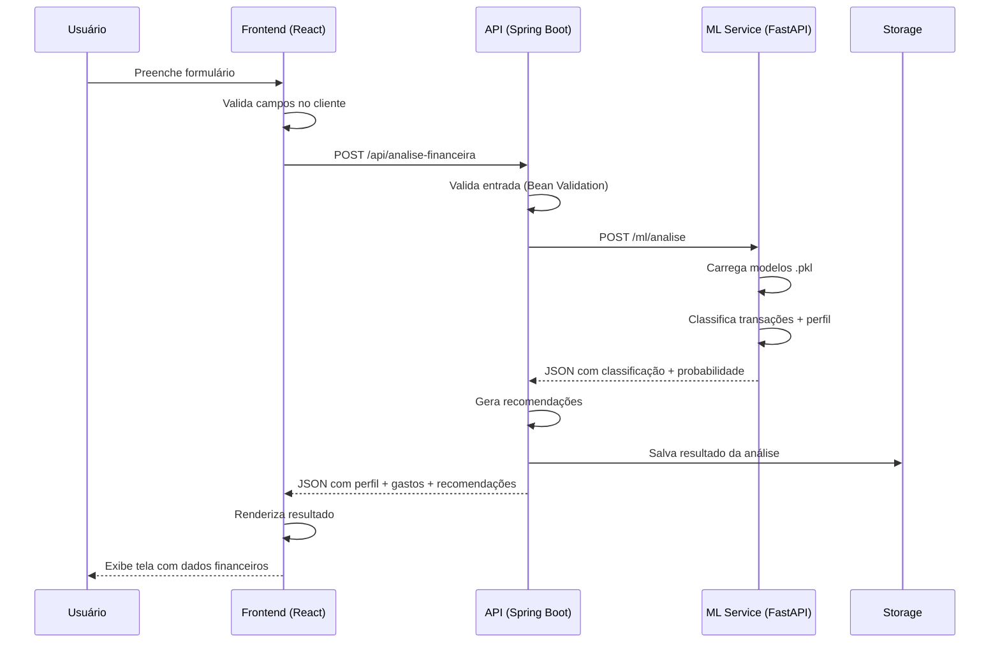

# Documentação de Arquitetura

## Sistema de Análise de Comportamento Financeiro e Recomendação Personalizada

---

## 1. Visão Geral da Arquitetura

O sistema é composto por três serviços independentes que rodam em containers Docker, orquestrados pelo docker compose:

```
┌─────────────────────────────────────────────────────────────────┐
│                        docker compose                            │
│                                                                 │
│  ┌──────────────┐    ┌──────────────┐    ┌──────────────────┐   │
│  │   Frontend   │    │     API      │    │   ML Service     │   │
│  │   (React)    │───▶│ Spring Boot  │───▶│   (FastAPI)      │   │
│  │   :3000      │    │   :8080      │    │   :8000          │   │
│  └──────────────┘    └──────┬───────┘    └──────────────────┘   │
│                             │                                    │
│                             ▼                                    │
│                      ┌──────────────┐                           │
│                      │  Armazenamento                           │
│                      │  Local ou OCI │                           │
│                      └──────────────┘                           │
└─────────────────────────────────────────────────────────────────┘
```

### 1.1 Fluxo de uma Requisição (Análise Financeira)



---

## 2. Decisões Técnicas

### 2.1 Por que FastAPI e não Flask para o ML Service?

| Critério | FastAPI | Flask |
|---|---|---|
| Performance | Assíncrono nativo (uvloop) | Síncrono |
| Validação | Pydantic integrado | Manual (marshmallow) |
| Documentação | OpenAPI automática | Necessário flasgger |
| Curva de aprendizado | Baixa (similar a Flask) | Baixa |
| Suporte a tipos | Type hints nativos | Sem type hints |

### 2.2 Por que React + Vite e não Next.js ou CRA?

- **Vite**: mais rápido que CRA, mais simples que Next.js (sem SSR)
- **React puro**: time de frontend já conhece
- **Nginx**: servindo build estático, deploy universal
- Não há necessidade de SSR ou rotas no servidor para o MVP

### 2.3 Por que docker compose?

- Ambiente idêntico em todas as máquinas
- Zero instalação de dependências (Java, Python, Node) nos notebooks da equipe
- Facilita CI/CD futuro
- Cada serviço pode ser desenvolvido e testado isoladamente

### 2.4 Por que WireMock e não o ml-service real nos testes?

- Testes mais rápidos (milissegundos vs. segundos)
- Cenários de erro controlados (timeout, 500, resposta malformada)
- Sem dependência do container Python nos testes do backend
- O contrato real é verificado separadamente (teste de contrato opcional)

### 2.5 Por que armazenamento em interface?

```java
public interface Armazenamento {
    void salvar(String id, String conteudo);
    Optional<String> carregar(String id);
}
```

- `ArmazenamentoLocal` → salva em arquivos (MVP)
- `ArmazenamentoOCI` → salva no Object Storage (produção)
- Trocado via `@Profile("oci")` ou variável de ambiente `ARMAZENAMENTO_TIPO`
- Zero alteração no código de negócio ao migrar

---

## 3. Estrutura do Projeto

```
nidus/
├── backend/                          # Spring Boot (API REST)
│   ├── Dockerfile
│   ├── pom.xml
│   └── src/
│       ├── main/java/com/nidus/
│       │   ├── controller/           # Endpoints REST
│       │   ├── dto/                  # Request/Response DTOs
│       │   ├── service/              # Regras de negócio
│       │   ├── validation/           # Validadores
│       │   └── infrastructure/       # Armazenamento, config
│       └── test/
├── ml-service/                       # FastAPI (ML)
│   ├── Dockerfile
│   ├── requirements.txt
│   ├── predictor.py                  # Serviço de predição
│   ├── models/                       # Modelos .pkl
│   └── tests/
├── frontend/                         # React + Vite
│   ├── Dockerfile
│   ├── package.json
│   ├── nginx.conf                    # Proxy reverso (produção)
│   ├── src/
│   │   ├── pages/                    # Páginas
│   │   ├── components/               # Componentes reutilizáveis
│   │   └── services/                 # Chamadas à API
│   └── tests/
├── notebooks/                        # Notebooks de treinamento
│   ├── eda.ipynb
│   └── treinamento.ipynb
├── docker-compose.yml
└── README.md
```

---

## 4. Armazenamento

### 4.1 Local (modo dev, `ARMAZENAMENTO_TIPO=local`)

- Diretório `./data/analises/` montado como volume Docker no serviço `api`
- Cada análise salva como `{id}.json`
- Simula o comportamento do OCI Object Storage
- Nenhuma credencial OCI necessária

### 4.2 OCI Object Storage (modo producao, `ARMAZENAMENTO_TIPO=oci`)

- Mesma interface `Armazenamento`
- Configurado via variáveis de ambiente:
  - `OCI_BUCKET_NAME`
  - `OCI_NAMESPACE`
  - `OCI_CONFIG_PATH`
- Trocado via variavel `ARMAZENAMENTO_TIPO=oci` ou profile `oci` no Spring Boot
- Deve ser implementado e compilado no codigo desde o MVP, mesmo que usado apenas na apresentacao

---

### 4.3 Regra de derivacao das chaves do resumo_gastos

As chaves do objeto `resumo_gastos` sao derivadas do nome oficial da categoria (conforme secao 3 do DICIONARIO.md) aplicando:

1. Conversao para minusculas
2. Remocao de acentos
3. Substituicao de espacos por underline (caso existam)

Exemplo: `"Alimentacao"` → `"alimentacao"`, `"Em observacao"` → `"em_observacao"`.

---

## 5. Estrategia de Migracao para OCI

| Componente | Local (MVP) | OCI (Produção) | Mudança |
|---|---|---|---|
| API | Container Docker | OCI Compute (mesma imagem) | Apenas deploy |
| ML Service | Container Docker | OCI Compute (mesma imagem) | Apenas deploy |
| Frontend | Container Docker | OCI Compute + Nginx | Apenas deploy |
| Armazenamento | Pasta `./data/` | OCI Object Storage | Trocar implementação via interface |
| Banco de dados | Não usado | OCI Autonomous DB (opcional) | Se necessário no futuro |

Nenhuma linha de código de negócio precisa ser alterada. A migração é puramente operacional.

### 5.1 Tratamento de timeout do ml-service

A API (Spring Boot) deve configurar timeout de conexao e leitura ao chamar o ml-service. Caso o ml-service nao responda dentro do limite (ex: 5s), a API deve retornar HTTP 504 com o codigo de erro `SERVICO_ML_INDISPONIVEL`, conforme catalogo do CONTRATOS.md.

---

## 6. Segurança

### 6.1 MVP (sem autenticação)

- A API não exige autenticação
- Recomendado rodar apenas em rede local
- Documentado como pendente para produção

### 6.2 Produção (OCI)

- RNF-SEG-003: controle de acesso via API Key ou JWT
- RNF-SEG-001: HTTPS via load balancer da OCI
- RNF-SEG-002: criptografia em repouso no Object Storage
- A ser definido em versão futura

---

## 7. Variáveis de Ambiente

| Variável | Serviço | Descrição | Default (MVP) |
|---|---|---|---|
| `ML_SERVICE_URL` | api | URL do ml-service | `http://ml-service:8000` |
| `ARMAZENAMENTO_TIPO` | api | local ou oci | `local` |
| `VITE_API_URL` | frontend | URL da API | `http://localhost:8080` |

---

## 8. Diagrama de Containers (docker compose)

```yaml
services:
  ml-service:
    build: ./ml-service
    ports:
      - "8000:8000"
    volumes:
      - ./ml-service/models:/app/models
    healthcheck:
      test: ["CMD", "curl", "-f", "http://localhost:8000/ml/health"]
      interval: 5s
      retries: 10
      start_period: 15s

  api:
    build: ./backend
    ports:
      - "8080:8080"
    volumes:
      - ./data/analises:/app/data/analises
    environment:
      - ML_SERVICE_URL=http://ml-service:8000
      - ARMAZENAMENTO_TIPO=local
    depends_on:
      ml-service:
        condition: service_healthy

  frontend:
    build: ./frontend
    ports:
      - "3000:3000"
    depends_on:
      - api
    environment:
      - VITE_API_URL=http://localhost:8080
```
