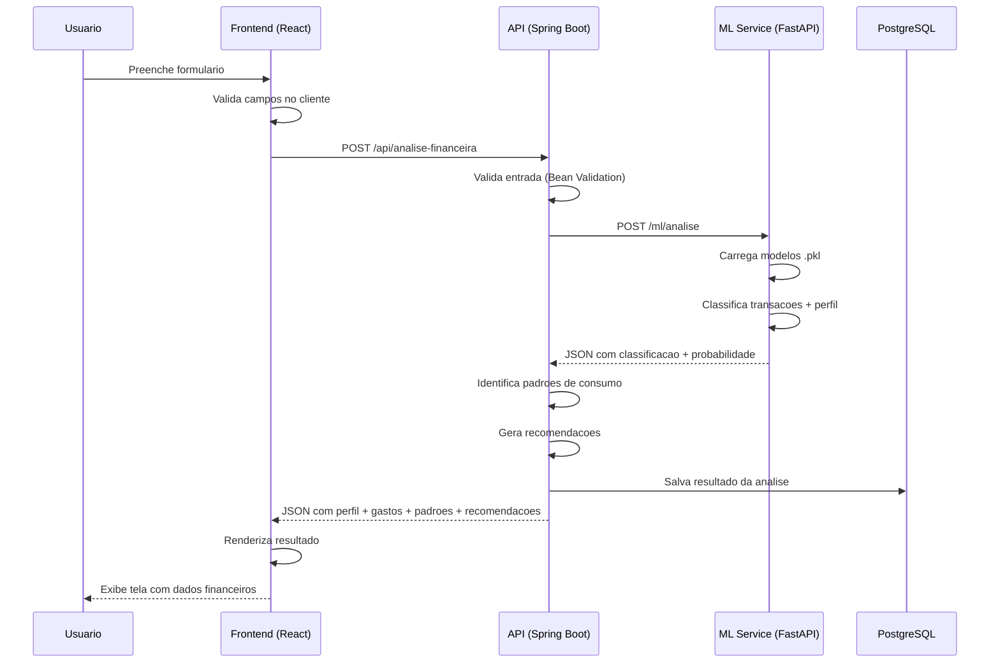
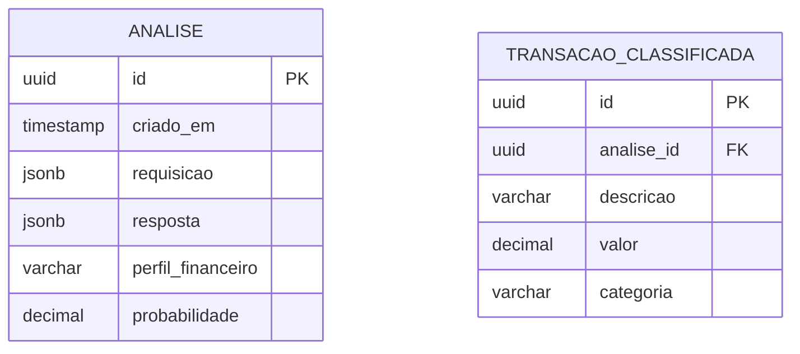

# Documentação de Arquitetura

## Sistema de Análise de Comportamento Financeiro e Recomendação Personalizada

---

## 1. Visão Geral da Arquitetura

O sistema é composto por quatro serviços independentes que rodam em containers Docker, orquestrados pelo docker compose:

```
┌─────────────────────────────────────────────────────────────────────┐
│                        docker compose                                │
│                                                                     │
│  ┌──────────────┐    ┌──────────────┐    ┌──────────────────┐       │
│  │   Frontend   │    │     API      │    │   ML Service     │       │
│  │   (React)    │───▶│ Spring Boot  │───▶│   (FastAPI)      │       │
│  │   :3000      │    │   :8080      │    │   :8000          │       │
│  └──────────────┘    └──────┬───────┘    └──────────────────┘       │
│                             │                                        │
│                             ▼                                        │
│                      ┌──────────────┐                               │
│                      │  PostgreSQL  │                               │
│                      │   :5432      │                               │
│                      └──────────────┘                               │
└─────────────────────────────────────────────────────────────────────┘
```

### 1.1 Fluxo de uma Requisição (Análise Financeira)



---

## 2. Decisões Técnicas

### 2.1 Por que FastAPI e não Flask para o ML Service?

| Critério | FastAPI | Flask |
|---|---|---|
| Performance | Assíncrono nativo (uvloop) | Síncrono |
| Validação | Pydantic integrado | Manual (marshmallow) |
| Documentação | OpenAPI automática | Necessário flasgger |
| Curva de aprendizado | Baixa (similar a Flask) | Baixa |
| Suporte a tipos | Type hints nativos | Sem type hints |

### 2.2 Por que React + Vite e não Next.js ou CRA?

- **Vite**: mais rápido que CRA, mais simples que Next.js (sem SSR)
- **React puro**: time de frontend já conhece
- **Nginx**: servindo build estático, deploy universal
- Não há necessidade de SSR ou rotas no servidor para o MVP

### 2.3 Por que docker compose?

- Ambiente idêntico em todas as máquinas
- Zero instalação de dependências (Java, Python, Node) nos notebooks da equipe
- Facilita CI/CD futuro
- Cada serviço pode ser desenvolvido e testado isoladamente
- O mesmo `docker-compose.yml` roda em desenvolvimento e em produção na OCI

### 2.4 Por que WireMock e não o ml-service real nos testes?

- Testes mais rápidos (milissegundos vs. segundos)
- Cenários de erro controlados (timeout, 500, resposta malformada)
- Sem dependência do container Python nos testes do backend
- O contrato real é verificado separadamente (teste de contrato opcional)

### 2.5 Por que PostgreSQL?

| Critério | PostgreSQL (escolhido) | H2 + AJD (alternativa) |
|---|---|---|
| Consistência dev/prod | Mesmo banco nos dois ambientes | H2 no dev, AJD Oracle na produção |
| Driver/ORM | JPA + `spring-boot-starter-data-jpa` | JDBC H2 + SODA Oracle |
| Número de implementações | 1 (repository JPA) | 2 (`ArmazenamentoLocal` + `ArmazenamentoAJD`) |
| Migração dev → prod | Nenhuma alteração de código | Trocar variável de ambiente e interface |
| Suporte Spring Boot | Excelente (nativo) | Médio (SODA precisa de driver Oracle) |
| Suporte Python | psycopg2, SQLAlchemy | Não se aplica (apenas Java) |
| Imagem Docker | `postgres:16-alpine` (oficial) | H2 em arquivo (sem container) |
| Facilidade para equipe Junior | JPA + banco relacional padrão | Interface + Oracle específico + wallet |

Com PostgreSQL, a API usa JPA diretamente com um único dialect. O ml-service também pode acessar o mesmo banco quando necessário, usando psycopg2. Em desenvolvimento roda em container Docker; em produção, o mesmo container roda na OCI Compute.

### 2.6 Por que OCI Compute e não outros serviços OCI?

O edital do hackathon exige a utilização de pelo menos um serviço OCI. O projeto adota o **OCI Compute** pelos seguintes motivos:

| Critério | OCI Compute (escolhido) | AJD | OCI Functions |
|---|---|---|---|
| Dev = Prod | Mesmo `docker-compose.yml` em ambos | Requer interface + wallet | Requer Fn CLI + deploy separado |
| Adaptação de código | Zero | Trocar implementação de armazenamento | Reescrever ml-service |
| Complexidade para equipe Junior | Baixa (Docker + SSH) | Média (Oracle wallet, SODA) | Alta (Fn CLI, IAM, VCN, cold start) |
| Tempo de resposta | Previsível | Previsível | Cold start compromete RNF-DES-001 |
| Custo | VM ligada continuamente | Paga por armazenamento | Paga por execução |
| Liberdade de SO/ferramentas | Total (VM Ubuntu) | Restrito a Oracle DB | Restrito ao runtime da função |

---

## 3. Estrutura do Projeto

```
nidus/
├── backend/                          # Spring Boot (API REST)
│   ├── Dockerfile
│   ├── pom.xml
│   └── src/
│       ├── main/
│       │   ├── java/com/nidus/
│       │   │   ├── NidusApplication.java
│       │   │   ├── controller/       # Endpoints REST
│       │   │   ├── dto/              # Request/Response DTOs
│       │   │   ├── model/            # Entidades JPA
│       │   │   ├── repository/       # Acesso a dados (JPA)
│       │   │   ├── service/          # Regras de negócio
│       │   │   └── validation/       # Validadores e exception handler
│       │   └── resources/
│       │       └── application.properties
│       └── test/
│           ├── java/com/nidus/
│           │   ├── controller/       # Testes de integração
│           │   └── service/          # Testes unitários
│           └── resources/
│               ├── application-test.properties
│               └── wiremock/         # Fixtures do WireMock
├── ml-service/                       # FastAPI (ML)
│   ├── Dockerfile
│   ├── requirements.txt
│   ├── main.py                       # Aplicação FastAPI
│   ├── predictor.py                  # Serviço de predição
│   ├── models/                       # Modelos .pkl
│   └── tests/
│       ├── test_main.py
│       └── test_predictor.py
├── frontend/                         # React + Vite
│   ├── Dockerfile                    # Build de produção (Nginx)
│   ├── Dockerfile.dev                # Dev server (Vite)
│   ├── Dockerfile.test               # Testes (Vitest)
│   ├── nginx.conf                    # Proxy reverso (produção)
│   ├── package.json
│   ├── index.html
│   ├── tsconfig.json
│   ├── vite.config.ts
│   └── src/
│       ├── main.tsx                  # Entry point
│       ├── App.tsx                   # Rotas
│       ├── pages/                    # Páginas
│       ├── components/               # Componentes reutilizáveis
│       ├── services/                 # Chamadas à API
│       ├── types/                    # Interfaces TypeScript
│       └── mocks/                    # MSW handlers
├── notebooks/                        # Notebooks de treinamento
│   ├── eda.ipynb
│   └── treinamento.ipynb
├── scripts/
│   └── gerar_dados.py                # Geração de dataset sintético
├── init.sql                          # Script de inicialização do banco
├── docker-compose.yml
├── docker-compose.test.yml
└── README.md
```

---

## 4. Banco de Dados

### 4.1 PostgreSQL (dev e produção)

- Imagem oficial: `postgres:16-alpine`
- Porta padrão: 5432
- Dados persistentes via volume Docker (`postgres_data:/var/lib/postgresql/data`)
- Inicialização automática via `init.sql` montado em `/docker-entrypoint-initdb.d/`
- Sem diferença entre desenvolvimento e produção — mesmo banco, mesmo driver, mesma configuração

### 4.2 Configuração da API (Spring Boot)

```properties
spring.datasource.url=jdbc:postgresql://db:5432/nidus
spring.datasource.username=${DB_USER:nidus}
spring.datasource.password=${DB_PASSWORD:nidus}
spring.jpa.hibernate.ddl-auto=update
spring.jpa.database-platform=org.hibernate.dialect.PostgreSQLDialect
```

### 4.3 Estrutura das Tabelas



### 4.4 Script de Inicialização (`init.sql`)

```sql
CREATE TABLE IF NOT EXISTS analise (
    id UUID PRIMARY KEY,
    criado_em TIMESTAMP WITH TIME ZONE NOT NULL DEFAULT NOW(),
    requisicao JSONB NOT NULL,
    resposta JSONB NOT NULL,
    perfil_financeiro VARCHAR(20) NOT NULL,
    probabilidade DECIMAL(4,2) NOT NULL
);

CREATE TABLE IF NOT EXISTS transacao_classificada (
    id UUID PRIMARY KEY,
    analise_id UUID NOT NULL REFERENCES analise(id),
    descricao VARCHAR(120) NOT NULL,
    valor DECIMAL(12,2) NOT NULL,
    categoria VARCHAR(20) NOT NULL
);

CREATE INDEX idx_analise_criado_em ON analise(criado_em DESC);
```

---

## 5. Estratégia de Deploy na OCI

| Componente | Desenvolvimento (local) | Produção (OCI Compute) |
|---|---|---|
| Frontend | Container Docker (`npm run dev`) | Container Docker (Nginx servindo build) |
| API | Container Docker (Spring Boot) | Container Docker (mesma imagem) |
| ML Service | Container Docker (FastAPI) | Container Docker (mesma imagem) |
| PostgreSQL | Container Docker (`postgres:16-alpine`) | Container Docker (volume persistente) |
| Orquestração | `docker compose up` | `docker compose up` na VM |
| Autenticação | Nenhuma (rede local) | Nenhuma no MVP (adição futura) |
| HTTPS | Nenhum | Load balancer OCI (futuro) |

O mesmo arquivo `docker-compose.yml` é usado em ambos os ambientes. A única diferença operacional é o endereço da VM na OCI.

### 5.1 Tratamento de timeout do ml-service

A API (Spring Boot) deve configurar timeout de conexão e leitura ao chamar o ml-service. Caso o ml-service não responda dentro do limite (ex: 5s), a API deve retornar HTTP 504 com o código de erro `SERVICO_ML_INDISPONIVEL`, conforme catálogo do CONTRATOS.md.

---

## 6. Segurança

### 6.1 MVP (sem autenticação)

- A API não exige autenticação
- Recomendado rodar apenas em rede local
- Dados financeiros trafegam em texto claro na rede interna dos containers
- A proteção em trânsito (HTTPS) e o controle de acesso serão adicionados após o MVP

### 6.2 Pós-MVP

| Requisito | Solução prevista |
|---|---|
| HTTPS | Load balancer OCI com certificado TLS |
| Autenticação | API Key ou JWT |
| Criptografia em repouso | Criptografia nativa do volume do container ou OCI Block Volume |
| Auditoria | Logs estruturados com correlation ID |

---

## 7. Variáveis de Ambiente

| Variável | Serviço | Descrição | Default (MVP) |
|---|---|---|---|
| `ML_SERVICE_URL` | api | URL do ml-service | `http://ml-service:8000` |
| `DB_URL` | api | URL de conexão com PostgreSQL | `jdbc:postgresql://db:5432/nidus` |
| `DB_USER` | api | Usuário do banco | `nidus` |
| `DB_PASSWORD` | api | Senha do banco | `nidus` |
| `VITE_API_URL` | frontend | URL da API | `http://localhost:8080` |

---

## 8. Diagrama de Containers (docker compose)

```yaml
services:
  db:
    image: postgres:16-alpine
    environment:
      POSTGRES_DB: nidus
      POSTGRES_USER: nidus
      POSTGRES_PASSWORD: nidus
    ports:
      - "5432:5432"
    volumes:
      - postgres_data:/var/lib/postgresql/data
      - ./init.sql:/docker-entrypoint-initdb.d/init.sql
    healthcheck:
      test: ["CMD-SHELL", "pg_isready -U nidus"]
      interval: 5s
      retries: 10
      start_period: 10s

  ml-service:
    build: ./ml-service
    ports:
      - "8000:8000"
    volumes:
      - ./ml-service/models:/app/models
    healthcheck:
      test: ["CMD", "curl", "-f", "http://localhost:8000/ml/health"]
      interval: 5s
      retries: 10
      start_period: 15s

  api:
    build: ./backend
    ports:
      - "8080:8080"
    environment:
      - ML_SERVICE_URL=http://ml-service:8000
      - DB_URL=jdbc:postgresql://db:5432/nidus
      - DB_USER=nidus
      - DB_PASSWORD=nidus
    depends_on:
      db:
        condition: service_healthy
      ml-service:
        condition: service_healthy

  frontend:
    build: ./frontend
    ports:
      - "3000:3000"
    depends_on:
      - api
    environment:
      - VITE_API_URL=http://localhost:8080

volumes:
  postgres_data:
```
