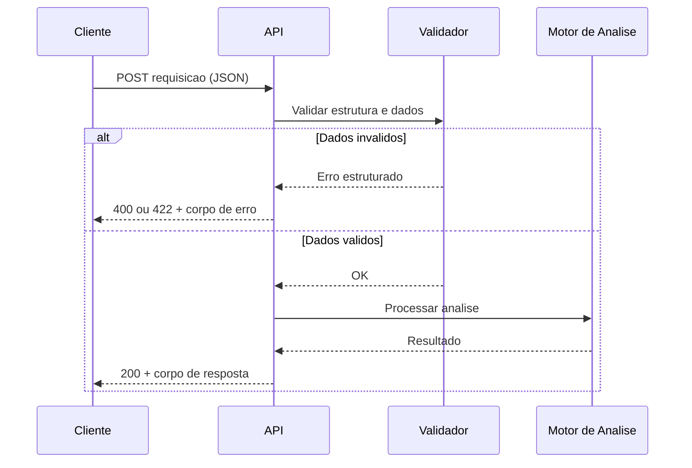
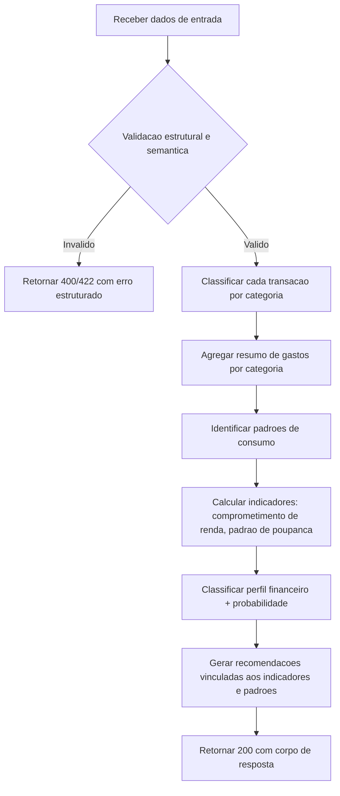
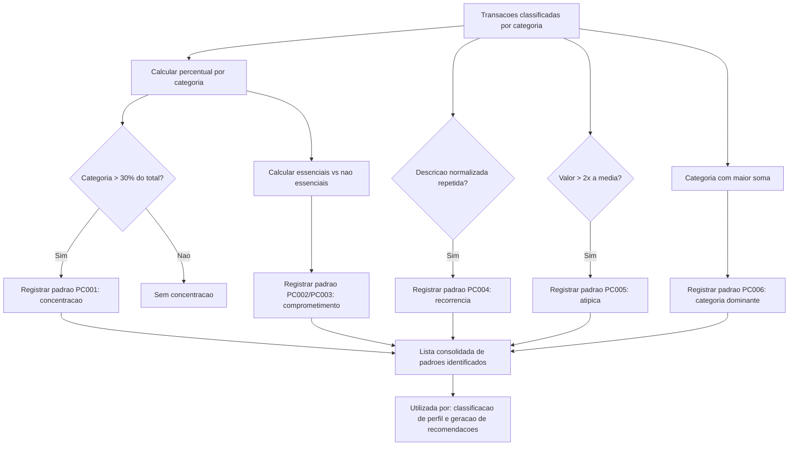

# Documentação de Contratos de API
## Análise de Comportamento Financeiro e Recomendação Personalizada

---

## 1. Propósito deste Documento

Este documento detalha os contratos de entrada e saída de cada endpoint da API REST, definindo estrutura de dados, tipos, obrigatoriedade, restrições de valor e comportamento esperado em cenários de sucesso e de erro. O objetivo é eliminar ambiguidades antes do início da implementação, servindo como referência única entre as equipes de Ciência de Dados e Back-End.

Este documento não define tecnologia de implementação. Os formatos aqui descritos (JSON, códigos HTTP) são requisitos funcionais do projeto, não escolhas de infraestrutura.

---

## 2. Convenções Gerais

### 2.1 Formato de Dados

Todas as requisições e respostas utilizam o formato JSON, com codificação UTF-8.

### 2.2 Convenção de Nomenclatura de Campos

Os campos seguem `camelCase`, em português, conforme padronizado entre frontend e backend.

### 2.3 Códigos de Status HTTP Utilizados

| Código | Significado | Quando ocorre |
|---|---|---|
| 200 | OK | Requisição processada com sucesso |
| 400 | Bad Request | Estrutura da requisição malformada (ex: JSON inválido, campo com tipo incorreto) |
| 422 | Unprocessable Entity | Estrutura válida, porém com dados semanticamente inválidos (ex: valor negativo, campo obrigatório ausente) |
| 500 | Internal Server Error | Falha inesperada no processamento interno (ex: falha ao carregar o modelo) |
| 504 | Gateway Timeout | O ml-service nao respondeu dentro do limite de tempo configurado |

### 2.4 Estrutura Padrão de Erro

Toda resposta de erro (400, 422 ou 500) segue a mesma estrutura, independente do endpoint:

```json
{
  "erro": {
    "codigo": "CAMPO_INVALIDO",
    "mensagem": "O campo 'rendaMensal' deve ser um numero positivo.",
    "campo": "rendaMensal",
    "timestamp": "2026-07-06T14:32:10Z"
  }
}
```

| Campo | Tipo | Descrição |
|---|---|---|
| codigo | string | Identificador padronizado do tipo de erro (ver catálogo na seção 5) |
| mensagem | string | Descrição legível do problema, sem exposição de dados sensíveis |
| campo | string ou null | Nome do campo que originou o erro, quando aplicável |
| timestamp | string (ISO 8601) | Momento em que o erro foi gerado |

### 2.5 Fluxo Geral de Requisição (visão conceitual)



---

## 3. Endpoint 1: Análise Financeira Completa

### 3.1 Identificação

| Item | Detalhe |
|---|---|
| Método | POST |
| Caminho | /analise-financeira |
| Descrição | Recebe os dados financeiros do usuário e retorna a classificação de perfil financeiro, o resumo de gastos por categoria e as recomendações associadas. |

### 3.2 Contrato de Entrada

```json
{
  "rendaMensal": 4500,
  "nivelEndividamento": 25,
  "frequenciaPoupanca": "Media",
  "transacoes": [
    {
      "descricao": "Supermercado",
      "valor": 420
    }
  ]
}
```

| Campo | Tipo | Obrigatório | Restrições |
|---|---|---|---|
| rendaMensal | número decimal | Sim | Deve ser maior que 0 |
| nivelEndividamento | número decimal | Sim | Deve estar entre 0 e 100 (representa percentual da renda comprometida) |
| frequenciaPoupanca | string (enum) | Sim | Valores aceitos: "Nenhuma", "Baixa", "Media", "Alta" |
| transacoes | lista de objetos | Sim | Deve conter no mínimo 1 transação |
| transacoes[].descricao | string | Sim | Não pode ser vazia; máximo de 120 caracteres |
| transacoes[].valor | número decimal | Sim | Deve ser maior que 0 |

### 3.3 Contrato de Saída (sucesso, 200)

```json
{
  "perfilFinanceiro": "Em observacao",
  "probabilidade": 0.82,
  "resumoGastos": {
    "alimentacao": 420,
    "transporte": 300,
    "lazer": 40
  },
  "padroesIdentificados": [
    "Categoria de maior gasto: Alimentacao",
    "Comprometimento de renda com gastos essenciais: 16%"
  ],
  "recomendacoes": [
    "Monitorar gastos recorrentes em Alimentacao",
    "Aumentar reserva financeira mensal"
  ]
}
```

| Campo | Tipo | Descrição |
|---|---|---|
| perfilFinanceiro | string (enum) | Um dos valores: "Saudavel", "Em observacao", "Em risco" |
| probabilidade | número decimal (0 a 1) | Nível de confiança da classificação do perfil |
| resumoGastos | objeto (chave dinâmica) | Mapa de categoria de despesa para valor total agregado. Somente categorias com transações presentes são exibidas (conforme RN de omissão de categorias vazias) |
| padroesIdentificados | lista de string | Lista de padrões de consumo identificados na análise (ver domínio no DICIONARIO.md). Cada string segue formato descritivo definido na seção 10. Pode ser vazia se nenhum padrão for detectado. |
| recomendacoes | lista de string | Uma ou mais recomendações objetivas, vinculadas aos indicadores identificados |

### 3.4 Fluxo de Decisão Interna (visão conceitual)



### 3.4.1 Fluxo de Identificacao de Padroes de Consumo



### 3.5 Exemplos Reais de Utilização

**Exemplo 1: Perfil "Em observação"**

Entrada:
```json
{
  "rendaMensal": 4500,
  "nivelEndividamento": 25,
  "frequenciaPoupanca": "Media",
  "transacoes": [
    { "descricao": "Supermercado", "valor": 420 },
    { "descricao": "Combustivel", "valor": 300 },
    { "descricao": "Streaming", "valor": 40 }
  ]
}
```

Saída:
```json
{
  "perfilFinanceiro": "Em observacao",
  "probabilidade": 0.57,
  "resumoGastos": {
    "Transporte": 300,
    "Alimentacao": 420,
    "Lazer": 40
  },
  "padroesIdentificados": [
    "Concentracao em Transporte (39,47% do total gasto)",
    "Concentracao em Alimentacao (55,26% do total gasto)",
    "Comprometimento de renda com gastos essenciais: 16%",
    "Gastos nao essenciais comprometem 1% da renda",
    "Categoria de maior gasto: Alimentacao"
  ],
  "recomendacoes": [
    "Aumentar reserva financeira mensal",
    "Monitorar gastos recorrentes em Alimentacao"
  ]
}
```

**Exemplo 2: Perfil "Saudavel"**

Entrada:
```json
{
  "rendaMensal": 8000,
  "nivelEndividamento": 5,
  "frequenciaPoupanca": "Alta",
  "transacoes": [
    { "descricao": "Aluguel", "valor": 1500 },
    { "descricao": "Farmacia", "valor": 120 },
    { "descricao": "Curso online", "valor": 200 }
  ]
}
```

Saida:
```json
{
  "perfilFinanceiro": "Saudavel",
  "probabilidade": 0.95,
  "resumoGastos": {
    "Moradia": 1500,
    "Saude": 120,
    "Educacao": 200
  },
  "padroesIdentificados": [
    "Concentracao em Moradia (82,42% do total gasto)",
    "Comprometimento de renda com gastos essenciais: 23%",
    "Gastos nao essenciais comprometem 0% da renda",
    "Transacao atipica: Aluguel (valor muito acima da media)",
    "Categoria de maior gasto: Moradia"
  ],
  "recomendacoes": [
    "Manter o padrao atual de poupanca e gastos",
    "Considerar reserva de emergencia adicional",
    "Monitorar gastos recorrentes em Moradia"
  ]
}
```

**Exemplo 3: Perfil "Em risco"**

Entrada:
```json
{
  "rendaMensal": 3000,
  "nivelEndividamento": 68,
  "frequenciaPoupanca": "Nenhuma",
  "transacoes": [
    { "descricao": "Cartao de credito", "valor": 900 },
    { "descricao": "Uber", "valor": 250 },
    { "descricao": "Delivery", "valor": 300 }
  ]
}
```

Saída:
```json
{
  "perfilFinanceiro": "Em risco",
  "probabilidade": 0.72,
  "resumoGastos": {
    "Transporte": 250,
    "Alimentacao": 300,
    "Servicos": 900
  },
  "padroesIdentificados": [
    "Concentracao em Servicos (62,07% do total gasto)",
    "Comprometimento de renda com gastos essenciais: 18%",
    "Gastos nao essenciais comprometem 30% da renda",
    "Categoria de maior gasto: Servicos"
  ],
  "recomendacoes": [
    "Priorizar quitacao de dividas para reduzir o comprometimento da renda",
    "Estabelecer meta minima de poupanca mensal, mesmo que o valor seja pequeno",
    "Reduzir o nivel de endividamento antes de assumir novos compromissos",
    "Revisar assinaturas e servicos contratados",
    "Monitorar gastos recorrentes em Servicos"
  ]
}
```

**Exemplo 4 (erro): Transação com valor inválido**

Entrada:
```json
{
  "rendaMensal": 4500,
  "nivelEndividamento": 25,
  "frequenciaPoupanca": "Media",
  "transacoes": [
    { "descricao": "Supermercado", "valor": -420 }
  ]
}
```

Saída (422):
```json
{
  "erro": {
    "codigo": "VALOR_TRANSACAO_INVALIDO",
    "mensagem": "O campo 'valor' da transacao deve ser maior que zero.",
    "campo": "transacoes[0].valor",
    "timestamp": "2026-07-06T14:32:10Z"
  }
}
```

---

## 4. Endpoint 2: Classificação de Transações

### 4.1 Identificação

| Item | Detalhe |
|---|---|
| Método | POST |
| Caminho | /classificacao-transacoes |
| Descrição | Recebe uma lista de transações e retorna a categoria financeira de cada uma, sem realizar análise de perfil. |

### 4.2 Contrato de Entrada

```json
{
  "transacoes": [
    { "descricao": "Supermercado", "valor": 420 },
    { "descricao": "Combustivel", "valor": 300 }
  ]
}
```

| Campo | Tipo | Obrigatório | Restrições |
|---|---|---|---|
| transacoes | lista de objetos | Sim | Deve conter no mínimo 1 transação |
| transacoes[].descricao | string | Sim | Não pode ser vazia; máximo de 120 caracteres |
| transacoes[].valor | número decimal | Sim | Deve ser maior que 0 |

### 4.3 Contrato de Saída (sucesso, 200)

```json
{
  "transacoesClassificadas": [
    {
      "descricao": "Supermercado",
      "valor": 420,
      "categoria": "Alimentacao"
    },
    {
      "descricao": "Combustivel",
      "valor": 300,
      "categoria": "Transporte"
    }
  ]
}
```

| Campo | Tipo | Descrição |
|---|---|---|
| transacoesClassificadas | lista de objetos | Uma entrada por transação recebida, na mesma ordem de envio |
| transacoesClassificadas[].descricao | string | Repete a descrição original recebida |
| transacoesClassificadas[].valor | número decimal | Repete o valor original recebido |
| transacoesClassificadas[].categoria | string (enum) | Categoria atribuída: "Alimentacao", "Transporte", "Saude", "Moradia", "Educacao", "Lazer", "Servicos", "Outras" |

### 4.4 Exemplos Reais de Utilização

**Exemplo 1: Múltiplas categorias**

Entrada:
```json
{
  "transacoes": [
    { "descricao": "Farmacia Popular", "valor": 85 },
    { "descricao": "Cinema", "valor": 60 }
  ]
}
```

Saída:
```json
{
  "transacoesClassificadas": [
    { "descricao": "Farmacia Popular", "valor": 85, "categoria": "Saude" },
    { "descricao": "Cinema", "valor": 60, "categoria": "Lazer" }
  ]
}
```

**Exemplo 2: Transação não reconhecida (categoria "Outras")**

Entrada:
```json
{
  "transacoes": [
    { "descricao": "Pagamento diverso XY123", "valor": 50 }
  ]
}
```

Saída:
```json
{
  "transacoesClassificadas": [
    { "descricao": "Pagamento diverso XY123", "valor": 50, "categoria": "Outras" }
  ]
}
```

**Exemplo 3 (erro): Lista vazia**

Entrada:
```json
{
  "transacoes": []
}
```

Saída (422):
```json
{
  "erro": {
    "codigo": "LISTA_TRANSACOES_VAZIA",
    "mensagem": "E necessario informar ao menos uma transacao para classificacao.",
    "campo": "transacoes",
    "timestamp": "2026-07-06T14:32:10Z"
  }
}
```

---

## 5. Catálogo de Códigos de Erro

| Código | Status HTTP | Descrição |
|---|---|---|
| JSON_MALFORMADO | 400 | O corpo da requisição não é um JSON válido |
| CAMPO_OBRIGATORIO_AUSENTE | 422 | Um campo obrigatório não foi informado |
| CAMPO_INVALIDO | 422 | Um campo foi informado com tipo ou formato incorreto |
| VALOR_TRANSACAO_INVALIDO | 422 | O valor de uma transação é menor ou igual a zero |
| LISTA_TRANSACOES_VAZIA | 422 | A lista de transações foi enviada sem nenhum item |
| ENUM_INVALIDO | 422 | Valor informado para um campo do tipo enumerado não pertence ao domínio aceito |
| FALHA_INTERNA_PROCESSAMENTO | 500 | Erro inesperado durante a execução da análise ou classificação |
| SERVICO_ML_INDISPONIVEL | 504 | O ml-service nao respondeu ou retornou erro antes de completar a classificacao |

---

# Contrato Interno: ML Service

Este contrato define a comunicação entre a API (Spring Boot) e o ML Service (FastAPI). A API chama o ML Service internamente para obter a classificação das transações e do perfil financeiro. O resultado é então enriquecido pela API com recomendações e armazenamento.

A validação de entrada é feita primariamente pela API (Spring Boot) com Bean Validation. O ml-service pode assumir que os dados recebidos já foram validados, simplificando sua lógica. Em caso de inconsistência, o ml-service retorna erro 422 com a mesma estrutura do catálogo de erros.

---

## 6. Endpoint Interno: Classificação ML

### 6.1 Identificação

| Item | Detalhe |
|---|---|
| Método | POST |
| Caminho | /ml/analise |
| Consumidor | API (Spring Boot) |
| Descrição | Recebe os dados financeiros completos e retorna a classificação das transações, o perfil financeiro e a probabilidade associada. |

### 6.2 Contrato de Entrada

```json
{
  "rendaMensal": 4500,
  "nivelEndividamento": 25,
  "frequenciaPoupanca": "Media",
  "transacoes": [
    { "descricao": "Supermercado", "valor": 420 },
    { "descricao": "Combustivel", "valor": 300 }
  ]
}
```

| Campo | Tipo | Obrigatório | Restrições |
|---|---|---|---|
| rendaMensal | número decimal | Sim | Deve ser maior que 0 |
| nivelEndividamento | número decimal | Sim | Deve estar entre 0 e 100 |
| frequenciaPoupanca | string (enum) | Sim | "Nenhuma", "Baixa", "Media", "Alta" |
| transacoes | lista de objetos | Sim | Mínimo 1 |
| transacoes[].descricao | string | Sim | 1 a 120 caracteres |
| transacoes[].valor | número decimal | Sim | Maior que 0 |

### 6.3 Contrato de Saída (sucesso, 200)

```json
{
  "perfilFinanceiro": "Em observacao",
  "probabilidade": 0.82,
  "transacoesClassificadas": [
    { "descricao": "Supermercado", "valor": 420, "categoria": "Alimentacao" },
    { "descricao": "Combustivel", "valor": 300, "categoria": "Transporte" }
  ]
}
```

| Campo | Tipo | Descrição |
|---|---|---|
| perfilFinanceiro | string (enum) | "Saudavel", "Em observacao", "Em risco" |
| probabilidade | número decimal (0 a 1) | Confiança da classificação |
| transacoesClassificadas | lista de objetos | Transações com categoria atribuída |
| transacoesClassificadas[].descricao | string | Descrição original |
| transacoesClassificadas[].valor | número decimal | Valor original |
| transacoesClassificadas[].categoria | string | Categoria atribuída (ver domínio no Dicionário) |

### 6.4 Contrato de Erro (422)

```json
{
  "erro": {
    "codigo": "VALOR_TRANSACAO_INVALIDO",
    "mensagem": "O campo 'valor' da transacao deve ser maior que zero.",
    "campo": "transacoes[0].valor",
    "timestamp": "2026-07-06T14:32:10Z"
  }
}
```

### 6.5 Endpoint de Health Check

| Item | Detalhe |
|---|---|
| Método | GET |
| Caminho | /ml/health |
| Consumidor | API (Spring Boot), docker healthcheck |
| Resposta (200) | `{ "status": "ok" }` |
| Resposta (503) | `{ "status": "loading" }` (modelos ainda carregando) |

### 6.6 Observações

- O ML Service é stateless: cada requisição carrega os modelos do disco
- Os modelos (.pkl) são carregados na inicialização do serviço
- O endpoint é chamado exclusivamente pela API (Spring Boot), nunca diretamente pelo frontend
- A URL do ML Service é configurada via variável de ambiente `ML_SERVICE_URL`
- A API deve tratar timeout de conexão com o ml-service e retornar 504 com `SERVICO_ML_INDISPONIVEL`
- A API não revalida campos que já foram validados na camada de entrada (Bean Validation), reduzindo processamento duplicado

---

## 7. Endpoint: Histórico de Análises

### 7.1 Identificação

| Item | Detalhe |
|---|---|
| Método | GET |
| Caminho | /historico-analises |
| Descrição | Retorna a lista das análises financeiras realizadas anteriormente, ordenadas da mais recente para a mais antiga. |

### 7.2 Contrato de Saída (sucesso, 200)

```json
{
  "analises": [
    {
      "id": "a1b2c3d4-e5f6-7890-abcd-ef1234567890",
      "criadoEm": "2026-07-06T14:32:10Z",
      "perfilFinanceiro": "Em observacao",
      "resumoGastos": {
        "alimentacao": 420,
        "transporte": 300,
        "lazer": 40
      }
    }
  ]
}
```

| Campo | Tipo | Descrição |
|---|---|---|
| analises | lista de objetos | Lista de análises anteriores, ordenadas da mais recente para a mais antiga |
| analises[].id | string (UUID v4) | Identificador único da análise |
| analises[].criadoEm | string (ISO 8601) | Momento em que a análise foi realizada |
| analises[].perfilFinanceiro | string (enum) | Perfil classificado na análise: "Saudavel", "Em observacao", "Em risco" |
| analises[].resumoGastos | objeto (chave dinâmica) | Mapa de categoria de despesa para valor total agregado |

### 7.3 Exemplos Reais de Utilização

**Exemplo 1: Com análises anteriores**

Requisição:
```
GET /historico-analises
```

Resposta (200):
```json
{
  "analises": [
    {
      "id": "c7d8e9f0-a1b2-3456-cdef-0987654321ab",
      "criadoEm": "2026-07-06T14:30:00Z",
      "perfilFinanceiro": "Em observacao",
      "resumoGastos": {
        "alimentacao": 420,
        "transporte": 300,
        "lazer": 40
      }
    },
    {
      "id": "b2c3d4e5-f6a7-8901-bcde-1234567890ab",
      "criadoEm": "2026-07-05T10:15:00Z",
      "perfilFinanceiro": "Em risco",
      "resumoGastos": {
        "servicos": 900,
        "transporte": 250,
        "alimentacao": 300
      }
    }
  ]
}
```

**Exemplo 2: Sem análises anteriores**

Requisição:
```
GET /historico-analises
```

Resposta (200):
```json
{
  "analises": []
}
```

### 7.4 Observações

- O limite máximo de análises retornadas é definido por configuração padrão (ex: 20)
- A listagem consulta as análises armazenadas no PostgreSQL (mesmo banco em dev e prod)
- Este endpoint depende da implementação de RF014 (registro automático de análises no armazenamento)

---

## 8. Observações de Rastreabilidade

Cada requisição processada deve gerar um identificador único de execução, conforme estabelecido em RN009 do documento de SRS. Esse identificador não faz parte obrigatória do contrato de resposta ao cliente, mas deve estar disponível internamente para fins de auditoria e depuração.

**Definição de geração:** um UUID v4 é gerado no controller da API (Spring Boot) no momento em que a requisição é recebida, antes de qualquer validação ou processamento. Esse UUID é armazenado como chave primária da análise no banco PostgreSQL e pode ser exposto futuramente como cabeçalho de resposta `X-Request-Id`, caso definido em versão futura do sistema.

---

