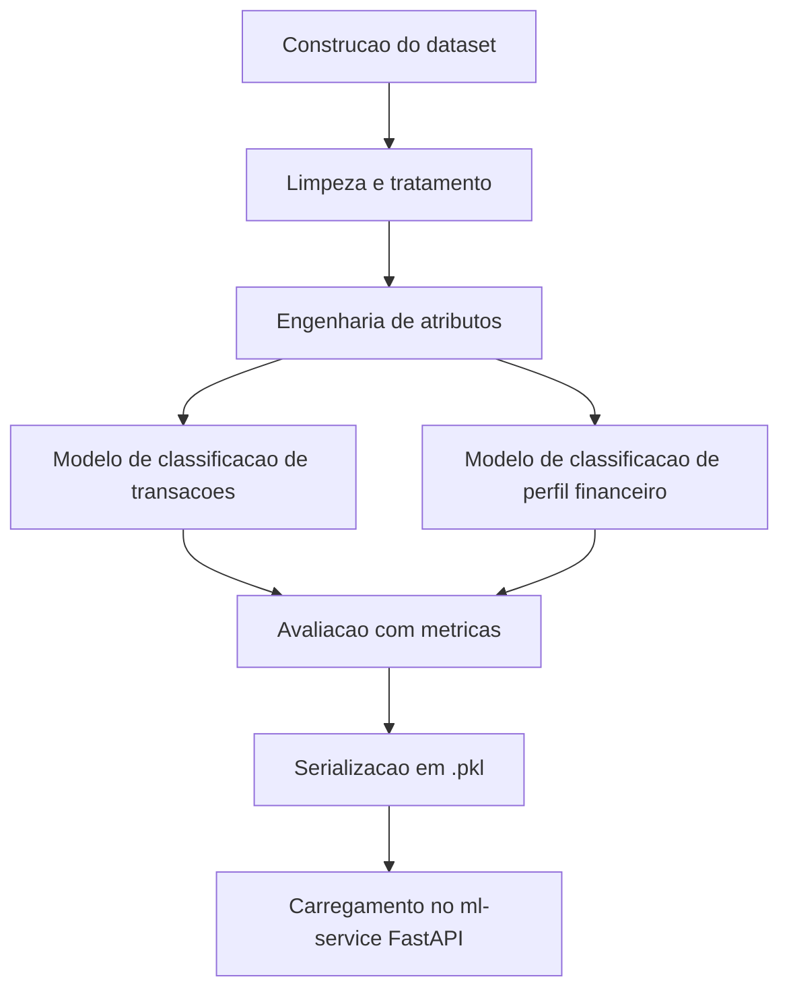
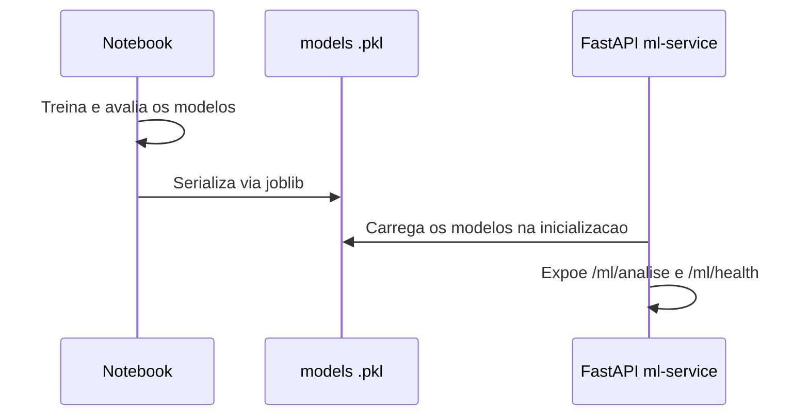

# Documentação de Ciência de Dados
## Sistema de Análise de Comportamento Financeiro e Recomendação Personalizada

---

## 1. Propósito deste Documento

Este documento formaliza as decisões da equipe de Ciência de Dados: como o conjunto de dados é construído, quais transformações são aplicadas, qual abordagem de modelagem é adotada, como os modelos são avaliados e como são entregues ao ml-service. Ele complementa o notebook, servindo como registro das razões por trás de cada escolha, e é a referência para as equipes de Back-End e Infra durante a integração.

---

## 2. Visão Geral do Pipeline

---

## 3. Construção do Dataset

O time constrói o próprio conjunto de dados, conforme permitido pelo edital, combinando três fontes:

| Fonte | Uso | Observação |
|---|---|---|
| Simulação programática | Geração de transações sintéticas por categoria, com descrições variadas e valores plausíveis | Principal fonte, garante volume e balanceamento entre categorias |
| Construção manual | Pequeno conjunto de descrições reais coletadas pela equipe, sem dados sensíveis de terceiros | Usado para dar variedade de linguagem natural ao classificador de texto |
| Bases públicas de referência | Consulta a faixas de renda, endividamento e poupança para calibrar limites realistas | Usada apenas como referência de calibração, não como dado bruto importado diretamente |

### 3.1 Dataset de Transações

Cada linha representa uma transação com `descricao` e `categoria` alvo, seguindo exatamente a taxonomia definida no DICIONARIO.md: Alimentação, Transporte, Saúde, Moradia, Educação, Lazer, Serviços, Outras.

Regras de geração:

- Cada categoria recebe um conjunto de templates de descrição (ex: para Alimentação, variações de "Supermercado", "Restaurante", "Ifood", "Padaria"), com ruído controlado de maiúsculas, abreviações e erros de digitação leves, refletindo as regras de normalização da seção 7 do DICIONARIO.md.
- A categoria "Outras" recebe descrições propositalmente ambíguas ou genéricas, para o modelo aprender a lidar com o caso de fronteira descrito na seção 8 do DICIONARIO.md.
- Casos de desambiguação (ex: "Farmacia e Conveniencia") são incluídos deliberadamente, rotulados conforme a regra de prioridade da seção 3.3 do DICIONARIO.md.

### 3.2 Dataset de Perfil Financeiro

Cada linha representa um usuário simulado com `renda_mensal`, `nivel_endividamento`, `frequencia_poupanca`, um conjunto agregado de transações, e o rótulo `perfil_financeiro`.

O rótulo é atribuído seguindo, de forma probabilística e não determinística, as tendências descritas na seção 4.2 do DICIONARIO.md, para evitar que o modelo aprenda uma regra única e rígida, o que contrariaria a RN003 do REQUISITOS.md.

---

## 4. Limpeza e Tratamento de Dados

| Etapa | Ação | Motivo |
|---|---|---|
| Remoção de duplicatas exatas | Elimina linhas idênticas geradas por erro no script de simulação | Evita viés de repetição no treino |
| Normalização de texto | Aplica as regras da seção 7 do DICIONARIO.md: trim, minúsculas, remoção de símbolos repetidos, tratamento consistente de acentos | Garante que o texto usado no treino seja equivalente ao texto normalizado na inferência |
| Validação de faixas numéricas | Confirma que `renda_mensal` maior que 0, `nivel_endividamento` entre 0 e 100, `valor` maior que 0 | Mantém o dataset de treino consistente com as mesmas regras aplicadas na validação de entrada da API |
| Tratamento de valores ausentes | Descarta linhas com campos obrigatórios ausentes, já que o dataset é gerado pela própria equipe e não deve conter lacunas | Simplicidade, sem necessidade de imputação |

---

## 5. Engenharia de Atributos

### 5.1 Classificação de Transações

| Atributo | Tipo | Descrição |
|---|---|---|
| Vetor TF-IDF da descrição normalizada | Numérico esparso | Captura padrões textuais das descrições, é a base do classificador |
| Comprimento da descrição | Numérico | Ajuda a distinguir descrições genéricas de específicas |
| Presença de palavras-chave por categoria | Binário | Reforço simples para categorias com vocabulário bem definido, como Moradia e Transporte |

### 5.2 Classificação de Perfil Financeiro

| Atributo | Tipo | Descrição |
|---|---|---|
| nivel_endividamento | Numérico | Direto do dado de entrada |
| frequencia_poupanca | Categórico codificado | Nenhuma, Baixa, Media, Alta, conforme domínio do DICIONARIO.md |
| proporcao_comprometimento_renda | Numérico derivado | Soma das transações dividida pela renda mensal |
| proporcao_gastos_nao_essenciais | Numérico derivado | Soma de Lazer e Serviços dividida pela renda mensal, alimenta diretamente os gatilhos REC004 e REC005 |
| proporcao_gastos_essenciais | Numérico derivado | Soma de Alimentação, Moradia, Saúde, Transporte e Educação dividida pela renda mensal |

---

## 6. Modelagem

| Modelo | Algoritmo escolhido | Justificativa |
|---|---|---|
| Classificação de transações | Regressão Logística ou Naive Bayes sobre TF-IDF | Simples, rápido de treinar, interpretável, adequado a um problema de classificação de texto com poucas categorias |
| Classificação de perfil financeiro | Random Forest | Lida bem com atributos numéricos e categóricos combinados, robusto a outliers de renda, gera importância de atributos útil para a explicabilidade opcional (RF017) |

A equipe optou por manter os dois modelos simples e interpretáveis, evitando redes neurais ou ensembles complexos, já que o volume de dados é limitado e o prazo é curto. Essa escolha está alinhada à preferência geral do projeto por soluções simples e claras.

---

## 7. Avaliação dos Modelos

| Modelo | Métricas usadas | Critério mínimo de aceite |
|---|---|---|
| Classificação de transações | Acurácia, F1-score por categoria, matriz de confusão | F1 médio ponderado acima de 0.80 |
| Classificação de perfil financeiro | Acurácia, F1-score por classe, probabilidade calibrada | F1 médio ponderado acima de 0.75, dado o caráter mais subjetivo do rótulo |

A matriz de confusão da classificação de transações recebe atenção especial na categoria "Outras", já que é o principal ponto de ambiguidade descrito na seção 8 do DICIONARIO.md.

O valor de `probabilidade` retornado pelo endpoint `/ml/analise` corresponde à confiança da própria predição do modelo (`predict_proba`), respeitando a faixa de 0 a 1 definida no DICIONARIO.md.

---

## 8. Serialização e Entrega ao ml-service

| Item | Definição |
|---|---|
| Formato de serialização | `joblib`, por já ser usado nas fixtures descritas em TESTES.md |
| Arquivos gerados | `modelo_transacoes.pkl`, `modelo_perfil.pkl` |
| Local de entrega | `ml-service/models/`, conforme estrutura definida em ARQUITETURA.md |
| Momento do carregamento | Na inicialização do FastAPI, mantendo o serviço stateless conforme RA004 |

---

## 9. Estrutura dos Notebooks

| Notebook | Conteúdo |
|---|---|
| `notebooks/eda.ipynb` | Exploração dos dados, distribuição de categorias, distribuição de renda e endividamento, análise de balanceamento das classes |
| `notebooks/treinamento.ipynb` | Engenharia de atributos, treino dos dois modelos, avaliação com métricas, geração dos arquivos `.pkl` |

Ambos os notebooks devem terminar com uma célula de conclusão em markdown, resumindo as métricas finais obtidas e qualquer limitação conhecida do modelo, para transparência com as demais equipes.

---

## 10. Limitações Conhecidas

| Limitação | Impacto | Mitigação possível |
|---|---|---|
| Dataset sintético não captura toda a variedade de linguagem real | Pode reduzir a acurácia em descrições muito informais fora do padrão de treino | Ampliar o conjunto de templates de descrição se houver tempo na Sprint 4 |
| Rótulo de perfil financeiro é probabilístico, não uma verdade absoluta | Duas análises com dados parecidos podem gerar perfis diferentes em casos de fronteira | Documentado como comportamento esperado, coerente com RN003 do REQUISITOS.md |
| Volume de dados limitado ao tempo do hackathon | Modelos mais simples têm menor variância com poucos dados | Escolha deliberada de algoritmos simples, descrita na seção 6 |

---
