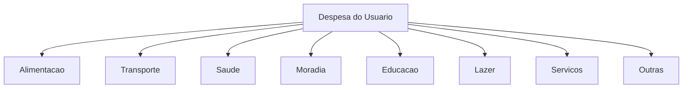
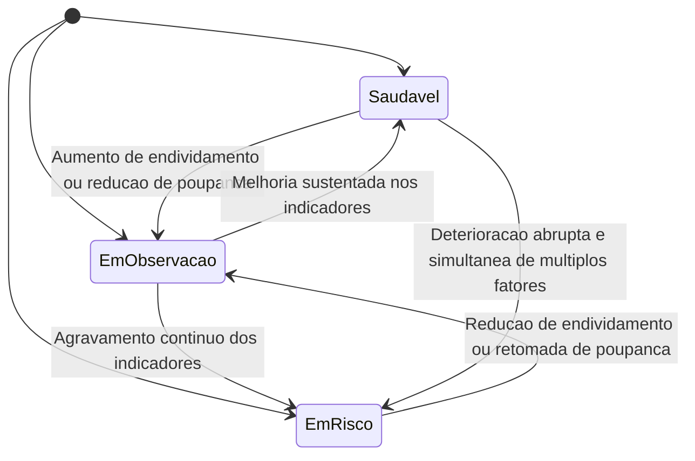

# Dicionário de Dados e Domínios de Valores
## Sistema de Análise de Comportamento Financeiro e Recomendação Personalizada

---

## 1. Propósito deste Documento

Este documento formaliza o significado, os limites válidos e as regras de interpretação de cada dado manipulado pelo sistema. Enquanto o documento de Contratos de API definiu a estrutura (formato JSON, obrigatoriedade), este documento define o conteúdo: o que cada valor representa, quais valores são aceitáveis e como casos ambíguos devem ser tratados.

Este documento é referência obrigatória para a equipe de Ciência de Dados (na definição de categorias de treinamento) e para a equipe de Back-End (na validação de entrada), garantindo que ambas as equipes utilizem exatamente as mesmas definições conceituais.

---

## 2. Dicionário de Dados Consolidado

| Campo | Tipo | Domínio / Formato | Obrigatório | Descrição Conceitual |
|---|---|---|---|---|
| renda_mensal | número decimal | Maior que 0 | Sim | Valor total de renda mensal declarada pelo usuário, antes de descontos |
| nivel_endividamento | número decimal | 0 a 100 | Sim | Percentual da renda mensal comprometido com dívidas ativas |
| frequencia_poupanca | string (enum) | "Nenhuma", "Baixa", "Media", "Alta" | Sim | Regularidade com que o usuário reserva parte da renda sem consumir |
| transacoes | lista de objetos | Mínimo 1 item | Sim | Conjunto de movimentações financeiras de saída (despesas) do usuário |
| transacoes[].descricao | string | 1 a 120 caracteres | Sim | Texto livre identificando a natureza da despesa |
| transacoes[].valor | número decimal | Maior que 0 | Sim | Valor monetário da transação individual |
| perfil_financeiro | string (enum) | "Saudavel", "Em observacao", "Em risco" | Sim (saída) | Classificação consolidada da saúde financeira do usuário |
| probabilidade | número decimal | 0 a 1 | Sim (saída) | Grau de confiança do modelo na classificação do perfil |
| resumo_gastos | objeto (chave dinâmica) | Chaves conforme domínio de categorias | Sim (saída) | Agregação de valores de transações por categoria identificada. As chaves seguem a regra de derivação: nome da categoria em minúsculas, sem acentos, espaços substituídos por underline (ex: "Alimentação" → "alimentacao", "Serviços" → "servicos") |
| recomendacoes | lista de string | Mínimo 1 item | Sim (saída) | Conjunto de orientações textuais vinculadas aos indicadores |
| categoria (classificação isolada) | string (enum) | Conforme domínio de categorias | Sim (saída) | Categoria atribuída a uma transação individual |

---

## 3. Domínio: Categorias de Despesas

### 3.1 Taxonomia

### 3.2 Definição e Critérios de Enquadramento

| Categoria | Definição Conceitual | Critério de Inclusão | Exemplos de Descrição (padrões esperados) |
|---|---|---|---|
| Alimentação | Despesas relacionadas ao consumo de alimentos e bebidas, dentro ou fora do domicílio | Transações associadas a compra, preparo ou consumo de comida | "Supermercado", "Restaurante", "Padaria", "Ifood", "Feira" |
| Transporte | Despesas relacionadas à locomoção do usuário | Transações associadas a deslocamento próprio (combustível, aplicativos de transporte, transporte público, manutenção veicular) | "Combustivel", "Uber", "Estacionamento", "Onibus", "Oficina Mecanica" |
| Saúde | Despesas relacionadas à manutenção física ou mental do usuário | Transações associadas a cuidados médicos, medicamentos, planos de saúde ou bem estar | "Farmacia", "Consulta Medica", "Plano de Saude", "Academia" |
| Moradia | Despesas relacionadas à manutenção do local de residência | Transações associadas a aluguel, condomínio, contas de consumo residencial ou reparos domésticos | "Aluguel", "Condominio", "Energia Eletrica", "Reforma" |
| Educação | Despesas relacionadas à formação ou capacitação do usuário | Transações associadas a cursos, mensalidades, material didático | "Mensalidade Escolar", "Curso Online", "Livros" |
| Lazer | Despesas relacionadas a entretenimento e descanso | Transações associadas a streaming, cinema, viagens de lazer, eventos | "Streaming", "Cinema", "Viagem", "Show" |
| Serviços | Despesas relacionadas a compromissos financeiros e serviços contratados de natureza não classificável nas demais categorias operacionais | Transações associadas a assinaturas administrativas, tarifas bancárias, cartão de crédito, serviços profissionais | "Cartao de Credito", "Tarifa Bancaria", "Assinatura Software" |
| Outras | Despesas cuja descrição não permite associação clara a nenhuma categoria anterior | Transações sem correspondência identificável nos critérios acima | "Pagamento Diverso", "Transferencia PIX Desconhecida" |

### 3.3 Regras de Desambiguação

| Regra | Aplicação |
|---|---|
| Prioridade de categoria específica sobre "Outras" | A categoria "Outras" só deve ser atribuída quando nenhuma outra categoria apresentar correspondência mínima |
| Transações com múltiplos sentidos possíveis | Descrições que poderiam pertencer a mais de uma categoria (ex: "Farmacia e Conveniencia") devem priorizar a categoria de maior relevância financeira típica: neste caso, Saúde |
| Novas categorias | A inclusão de categorias adicionais deve ser registrada neste documento antes de ser incorporada ao treinamento do modelo, conforme RN010 do SRS |

---

## 4. Domínio: Perfil Financeiro

### 4.1 Definição das Categorias

| Perfil | Definição Conceitual |
|---|---|
| Saudável | Usuário demonstra equilíbrio entre renda, endividamento e poupança, com baixo comprometimento de renda e regularidade em reservas financeiras |
| Em observação | Usuário apresenta sinais parciais de desequilíbrio, seja por comprometimento moderado de renda, seja por irregularidade na poupança, sem configurar risco imediato |
| Em risco | Usuário apresenta comprometimento elevado de renda com dívidas, ausência ou baixa frequência de poupança, e padrão de gastos concentrado em categorias não essenciais |

### 4.2 Fatores de Influência (natureza qualitativa, não determinística)

Conforme RN003 do SRS, nenhum fator isolado determina o perfil. A tabela abaixo descreve tendências conceituais que orientam a construção do modelo de classificação pela equipe de Ciência de Dados, não uma fórmula fixa de decisão.

| Fator | Tendência ao perfil "Saudável" | Tendência ao perfil "Em risco" |
|---|---|---|
| nivel_endividamento | Valores baixos | Valores elevados |
| frequencia_poupanca | "Alta" ou "Media" | "Nenhuma" ou "Baixa" |
| Concentração de gastos em categorias não essenciais (Lazer, Serviços) | Baixa proporção sobre a renda | Alta proporção sobre a renda |
| Regularidade dos gastos essenciais (Alimentação, Moradia, Saúde, Transporte, Educação) frente à renda | Proporção equilibrada | Proporção desproporcional à renda declarada |

### 4.3 Transições Conceituais entre Perfis

---

## 5. Domínio: Frequência de Poupança

| Valor | Definição Conceitual |
|---|---|
| Nenhuma | O usuário declara não reservar nenhuma parte da renda regularmente |
| Baixa | O usuário reserva parte da renda de forma esporádica, sem periodicidade definida |
| Media | O usuário reserva parte da renda com alguma regularidade, mas não em todos os períodos |
| Alta | O usuário reserva parte da renda de forma consistente e recorrente |

Este campo é de natureza declarativa (autoinformado pelo usuário), não sendo calculado automaticamente pelo sistema nesta versão do MVP.

---

## 6. Domínio: Indicadores Numéricos

| Campo | Unidade | Precisão | Faixa Válida | Observação |
|---|---|---|---|---|
| renda_mensal | Valor monetário (moeda não especificada, tratada de forma agnóstica pelo sistema) | Até 2 casas decimais | Maior que 0 | Não há limite superior definido; valores muito elevados não devem gerar erro, apenas refletir no cálculo dos indicadores |
| nivel_endividamento | Percentual | Até 2 casas decimais | 0 a 100 | Representa o percentual da renda mensal comprometido com dívidas; valor 0 é válido e representa ausência de dívidas |
| transacoes[].valor | Valor monetário | Até 2 casas decimais | Maior que 0 | Transações com valor 0 não são aceitas, pois não representam uma despesa efetiva |
| probabilidade (saída) | Índice adimensional | Até 2 casas decimais | 0 a 1 | Quanto mais próximo de 1, maior a confiança do modelo na classificação atribuída |

---

## 7. Regras de Normalização de Texto para Descrições de Transações

Antes da classificação, toda descrição de transação deve passar pelas seguintes regras de normalização conceitual, garantindo consistência entre o texto informado pelo usuário e o texto utilizado no processo de classificação:

| Ordem | Regra | Exemplo |
|---|---|---|
| 1 | Remoção de espaços em branco no início e no fim do texto | "  Supermercado " vira "Supermercado" |
| 2 | Conversão para caixa uniforme (ex: minúsculas) para fins de comparação interna | "SUPERMERCADO" e "Supermercado" devem ser tratados como equivalentes |
| 3 | Remoção de caracteres especiais não significativos (ex: múltiplos espaços, símbolos repetidos) | "Supermercado!!!" vira "Supermercado" |
| 4 | Tratamento de acentuação de forma consistente (mantendo ou removendo acentos de forma padronizada em todo o processo) | "Combustível" e "Combustivel" devem ser tratados como equivalentes internamente |
| 5 | Preservação do texto original recebido na resposta ao cliente | O campo "descricao" retornado deve refletir exatamente o texto enviado na requisição, independentemente da normalização interna aplicada para classificação |

---

## 8. Regras de Tratamento de Casos de Fronteira

| Situação | Tratamento Esperado |
|---|---|
| Descrição de transação muito genérica (ex: "Pagamento") | Classificar como "Outras", salvo contexto adicional disponível |
| Valor de transação muito elevado em relação à renda mensal | Não gera erro de validação; o valor deve ser considerado normalmente nos indicadores, podendo influenciar a classificação de perfil |
| nivel_endividamento igual a 100 | Valor válido; representa comprometimento total da renda com dívidas |
| frequencia_poupanca ausente de correspondência exata ao enum (ex: erro de digitação futuro em integrações) | Deve ser rejeitado com código de erro ENUM_INVALIDO, conforme catálogo de erros do documento de Contratos de API |
| Lista de transações com descrições duplicadas | Cada transação deve ser tratada e classificada de forma independente, mesmo que a descrição se repita |

---

## 9. Domínio: Recomendações

### 9.1 Matriz de Gatilho e Texto

Toda recomendação gerada deve estar vinculada a um indicador identificado na análise (RN004). A tabela abaixo define os gatilhos e os textos correspondentes.

| ID | Gatilho | Recomendação |
|---|---|---|
| REC001 | Perfil "Em risco" | Priorizar quitação de dívidas para reduzir o comprometimento da renda |
| REC002 | Perfil "Em risco" e frequencia_poupanca = "Nenhuma" | Estabelecer meta mínima de poupança mensal, mesmo que o valor seja pequeno |
| REC003 | Perfil "Em observacao" e frequencia_poupanca = "Baixa" ou "Media" | Aumentar reserva financeira mensal |
| REC004 | Concentração de gastos em Lazer > 30% da renda | Reduzir gastos com lazer e entretenimento |
| REC005 | Concentração de gastos em Servicos > 25% da renda | Revisar assinaturas e serviços contratados |
| REC006 | nivel_endividamento > 40 | Reduzir o nível de endividamento antes de assumir novos compromissos |
| REC007 | Perfil "Saudavel" e frequencia_poupanca = "Alta" | Manter o padrão atual de poupança e gastos |
| REC008 | Perfil "Saudavel" e frequencia_poupanca = "Media" | Considerar aumentar a reserva de emergência |
| REC009 | Categoria com maior gasto identificada | Monitorar gastos recorrentes em {categoria} |
| REC010 | Nenhum gatilho específico ativado | Manter o acompanhamento regular dos seus gastos |

### 9.2 Regras de Ativação

- Podem ser ativadas múltiplas recomendações em uma mesma análise
- A ordem de exibição deve priorizar recomendações vinculadas ao perfil (REC001 a REC003), depois as vinculadas a indicadores específicos (REC004 a REC009), por último a genérica (REC010)
- REC010 só deve ser exibida quando nenhuma outra recomendação for ativada

---

## 10. Domínio: Padrões de Consumo

### 10.1 Definição dos Padrões

Cada padrão é calculado a partir das transações classificadas e dos dados financeiros de entrada, dentro de uma única requisição.

| ID | Padrão | Definição | Regra de Cálculo | Exemplo de Saída |
|---|---|---|---|---|
| PC001 | Concentracao de categoria | Categoria que consome parcela desproporcional do total gasto | percentual_categoria = valor_categoria / soma_total_transacoes; concentracao se > 30% | "Concentração em Lazer (35% do total gasto)" |
| PC002 | Comprometimento de renda por essenciais | Proporção da renda mensal usada em categorias essenciais (Alimentacao, Moradia, Saude, Transporte, Educacao) | soma_essenciais / renda_mensal | "Gastos essenciais comprometem 42% da renda" |
| PC003 | Comprometimento de renda por nao essenciais | Proporção da renda usada em Lazer e Servicos | soma_nao_essenciais / renda_mensal | "Gastos não essenciais comprometem 8% da renda" |
| PC004 | Gasto recorrente | Descrição de transação repetida (normalizada, seção 7) mais de uma vez na mesma requisição | contagem_descricao_normalizada > 1 | "Padrão recorrente: Streaming (2 ocorrências)" |
| PC005 | Transacao atipica | Transação cujo valor é muito superior à média das demais | valor > (media_transacoes * 2) | "Transação atípica: Viagem (valor muito acima da média)" |
| PC006 | Categoria dominante | Categoria com maior soma de valor entre todas | max(resumo_gastos) | "Categoria de maior gasto: Alimentacao" |

### 10.2 Regras de Ativação dos Padrões

- Um padrão só é considerado "identificado" quando sua regra de cálculo é atendida
- Podem ser ativados múltiplos padrões em uma mesma análise
- A lista de padrões identificados é exposta no campo `padroes_identificados` da resposta (ver CONTRATOS.md)
- Todo padrão ativado deve gerar ao menos uma recomendação vinculada (RN004), mas nem toda recomendação precisa derivar de um padrão (ex: REC001 deriva do perfil, não de um padrão específico)

---

## 11. Glossário de Termos do Domínio

| Termo | Definição |
|---|---|
| Transação | Registro individual de uma despesa informada pelo usuário, composto por descrição e valor |
| Categoria financeira | Agrupamento conceitual atribuído a uma transação, refletindo a natureza do gasto |
| Perfil financeiro | Classificação consolidada da saúde financeira do usuário, derivada da combinação de múltiplos indicadores |
| Indicador financeiro | Métrica calculada a partir dos dados de entrada (ex: proporção de comprometimento de renda) que subsidia a classificação de perfil |
| Recomendação | Orientação textual objetiva, gerada a partir da relação entre os indicadores identificados e o perfil financeiro do usuário |
| Probabilidade / Confiança | Medida que expressa o grau de certeza do modelo analítico ao atribuir uma classificação de perfil |

---

