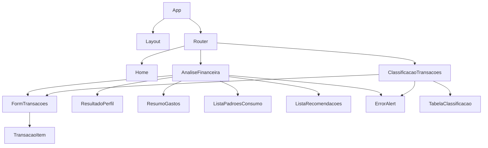

# Documentação do Frontend

## Sistema de Análise de Comportamento Financeiro e Recomendação Personalizada

---

## 1. Stack Tecnológica

| Tecnologia | Versão | Finalidade |
|---|---|---|
| React | 19+ | Biblioteca de UI |
| TypeScript | 5+ | Tipagem estática |
| Vite | 7+ | Build tool e dev server |
| React Router | 7+ | Roteamento |
| Bootstrap ou Tailwind | - | Estilização (a definir pela equipe) |
| MSW | 2+ | Mock de API nos testes |
| Vitest | 1+ | Testes unitários e de integração |
| React Testing Library | 14+ | Testes de componentes |
| Nginx | stable | Servir build de produção |

---

## 2. Estrutura de Arquivos

```
frontend/
├── public/
├── src/
│   ├── pages/
│   │   ├── AnaliseFinanceira.tsx        ← Formulário + resultado da análise
│   │   └── ClassificacaoTransacoes.tsx  ← Lista de transações + categorias
│   ├── components/
│   │   ├── Layout.tsx                  ← Header, nav, footer
│   │   ├── FormTransacoes.tsx          ← Lista dinâmica de transações
│   │   ├── ResultadoPerfil.tsx         ← Card com perfil + probabilidade
│   │   ├── ResumoGastos.tsx            ← Gráfico/tabela de gastos por categoria
│   │   ├── ListaPadroesConsumo.tsx     ← Lista de padrões de consumo
│   │   ├── ListaRecomendacoes.tsx      ← Lista de recomendações
│   │   ├── TabelaClassificacao.tsx     ← Tabela descrição/valor/categoria
│   │   └── ErrorAlert.tsx             ← Exibição de erros da API
│   ├── services/
│   │   └── api.ts                      ← Chamadas HTTP para o backend
│   ├── types/
│   │   └── index.ts                    ← Interfaces TypeScript
│   ├── mocks/
│   │   ├── handlers.ts                 ← MSW handlers
│   │   ├── server.ts                   ← MSW server setup
│   │   └── data.ts                     ← Dados mockados
│   ├── App.tsx                         ← Rotas
│   └── main.tsx                        ← Entry point
├── nginx.conf                          ← Configuração do proxy reverso
├── Dockerfile
├── Dockerfile.test
├── package.json
├── tsconfig.json
└── vite.config.ts
```

---

## 3. Fluxo de Navegação

```mermaid
graph TD
    H["/ (Home)"] -->|Clique em "Análise Financeira"| AF["/analise-financeira"]
    H -->|Clique em "Classificação de Transações"| CT["/classificacao-transacoes"]

    AF -->|Preenche formulário + submete| AFR[Exibe Resultado da Análise]
    AF -->|Erro de validação| AFE[Exibe Erro da API]

    CT -->|Preenche transações + submete| CTR[Exibe Tabela de Classificação]
    CT -->|Erro de validação| CTE[Exibe Erro da API]

    AFR -->|Nova análise| AF
    CTR -->|Nova classificação| CT
```

## 4. Hierarquia de Componentes



## 5. Páginas

### 5.1 Página Inicial

Rota: `/`

Exibe dois cards com links para as funcionalidades do sistema:

- **Análise Financeira Completa** → `/analise-financeira`
- **Classificação de Transações** → `/classificacao-transacoes`

### 5.2 Análise Financeira

Rota: `/analise-financeira`

**Campos do formulário:**

| Campo | Tipo | Componente |
|---|---|---|
| Renda Mensal | Input numérico | `<input type="number" />` |
| Nível de Endividamento (%) | Input numérico (range 0-100) | `<input type="range" />` + label |
| Frequência de Poupança | Select | `<select>` com Nenhuma, Baixa, Media, Alta |
| Transações | Lista dinâmica | `<FormTransacoes />` |

**FormTransacoes - Lista de transações:**

```
┌──────────────────────────────────────┐
│ Descrição        │ Valor │ [Adicionar]│
├──────────────────────────────────────┤
│ Supermercado     │ 420   │    [✕]    │
│ Combustivel      │ 300   │    [✕]    │
│ Streaming        │ 40    │    [✕]    │
└──────────────────────────────────────┘
```

**Resultado (após submissão):**

```
┌─────────────────────────────────┐
│  Perfil Financeiro              │
│  ┌─────────────────────────┐    │
│  │     Em observação       │    │
│  │     Confiança: 82%      │    │
│  └─────────────────────────┘    │
│                                 │
│  Resumo de Gastos               │
│  ┌──────────┬───────┐          │
│  │ Categoria│ Valor │          │
│  ├──────────┼───────┤          │
│  │Alimentaç.│ 420   │          │
│  │Transporte│ 300   │          │
│  │Lazer     │ 40    │          │
 │  └──────────┴───────┘          │
│                                 │
│  Padrões de Consumo             │
│  • Categoria de maior gasto:    │
│    Alimentação                  │
│  • Comprometimento de renda     │
│    com gastos essenciais: 16%   │
│                                 │
│  Recomendações                  │
│  • Monitorar gastos recorrentes │
│    em Alimentação               │
│  • Aumentar reserva financeira  │
└─────────────────────────────────┘
```

### 5.3 Classificação de Transações

Rota: `/classificacao-transacoes`

**Formulário:** Mesmo componente `FormTransacoes` (lista dinâmica)

**Resultado:**

```
┌─────────────────────────────────────┐
│ Descrição         │ Valor │ Categoria│
├─────────────────────────────────────┤
│ Supermercado      │ 420   │Alimentaç.│
│ Farmacia Popular  │ 85    │ Saúde    │
│ Pagamento Diverso │ 50    │ Outras   │
└─────────────────────────────────────┘
```

---

## 6. Tipos TypeScript

```ts
// types/index.ts

interface Transacao {
    descricao: string;
    valor: number;
}

interface AnaliseFinanceiraRequest {
    renda_mensal: number;
    nivel_endividamento: number;
    frequencia_poupanca: "Nenhuma" | "Baixa" | "Media" | "Alta";
    transacoes: Transacao[];
}

interface AnaliseFinanceiraResponse {
    perfil_financeiro: "Saudavel" | "Em observacao" | "Em risco";
    probabilidade: number;
    resumo_gastos: Record<string, number>;
    padroes_identificados: string[];
    recomendacoes: string[];
}

interface ClassificacaoTransacoesRequest {
    transacoes: Transacao[];
}

interface ClassificacaoTransacoesResponse {
    transacoes_classificadas: (Transacao & { categoria: string })[];
}

interface ErroResponse {
    erro: {
        codigo: string;
        mensagem: string;
        campo: string | null;
        timestamp: string;
    };
}
```

---

## 7. Chamadas à API

```ts
// services/api.ts

const API_BASE = "/api";

export async function analisarFinanceiro(
    dados: AnaliseFinanceiraRequest
): Promise<AnaliseFinanceiraResponse> {
    const response = await fetch(`${API_BASE}/analise-financeira`, {
        method: "POST",
        headers: { "Content-Type": "application/json" },
        body: JSON.stringify(dados),
    });

    if (!response.ok) {
        const erro: ErroResponse = await response.json();
        throw erro;
    }

    return response.json();
}

export async function classificarTransacoes(
    dados: ClassificacaoTransacoesRequest
): Promise<ClassificacaoTransacoesResponse> {
    // similar ao acima
}
```

---

## 8. Proxy no Desenvolvimento (Vite)

```ts
// vite.config.ts
export default defineConfig({
    plugins: [react()],
    server: {
        port: 3000,
        proxy: {
            "/api": {
                target: "http://api:8080",
                changeOrigin: true,
                rewrite: (path) => path.replace(/^\/api/, ""),
            },
        },
    },
});
```

O frontend faz requisições para `/api/analise-financeira` e o Vite redireciona para o Spring Boot removendo o prefixo `/api`, de forma que a chamada chega como `/analise-financeira` no backend. Sem a função `rewrite`, o Vite encaminharia o caminho completo com `/api`, causando 404. Em produção, o Nginx faz o mesmo papel com `proxy_pass http://api:8080/` (barra no final remove o prefixo automaticamente).

---

## 9. Produção (Nginx)

```nginx
# nginx.conf
server {
    listen 3000;
    root /usr/share/nginx/html;

    location /api/ {
        proxy_pass http://api:8080/;
        proxy_set_header Host $host;
    }

    location / {
        try_files $uri $uri/ /index.html;
    }
}
```

---

## 10. Docker

### Dockerfile (desenvolvimento)

```dockerfile
FROM node:24-alpine
WORKDIR /app
COPY package.json package-lock.json ./
RUN npm install
COPY . .
EXPOSE 3000
CMD ["npm", "run", "dev"]
```

### Dockerfile (produção)

```dockerfile
FROM node:24-alpine AS build
WORKDIR /app
COPY . .
RUN npm install && npm run build

FROM nginx:stable-alpine
COPY --from=build /app/dist /usr/share/nginx/html
COPY nginx.conf /etc/nginx/conf.d/default.conf
EXPOSE 3000
CMD ["nginx", "-g", "daemon off;"]
```

---

## 11. Responsabilidades

| Pessoa | O que faz |
|---|---|
| Frontend | Componentes, páginas, chamadas à API, testes, Dockerfile |
| Back-end | Garante que os endpoints estão funcionando, revisa contratos |
| Ciência de Dados | Usa o frontend para testar o modelo manualmente |
| Infra e QA | Testa o fluxo completo abrindo `localhost:3000`, preenchendo formulários e reportando bugs |
