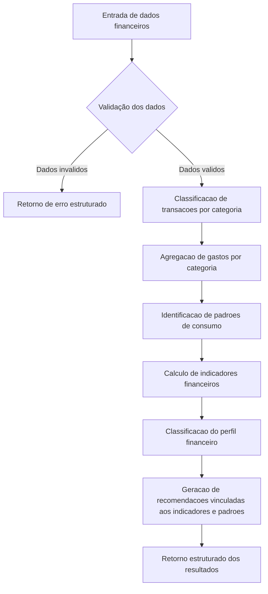
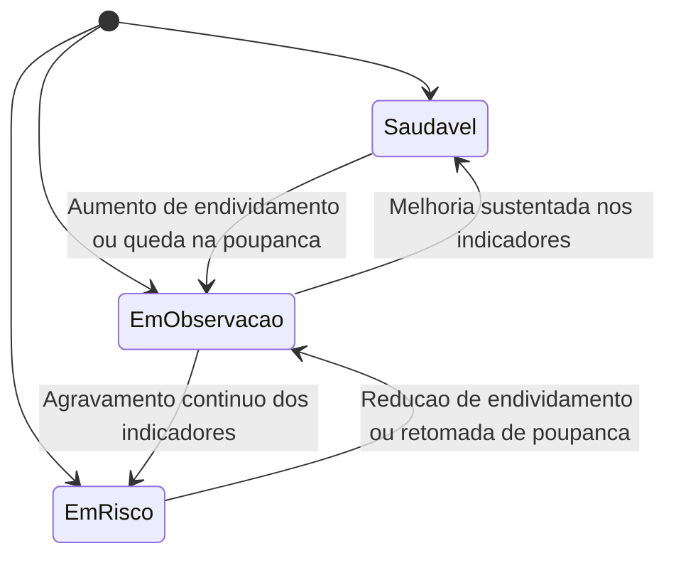

# Documentação de Requisitos de Software (SRS)
## Sistema de Análise de Comportamento Financeiro e Recomendação Personalizada

---

## 1. VISÃO GERAL DO PROJETO

### 1.1 Contexto e Objetivos

Um número expressivo de usuários possui acesso aos dados brutos de suas transações financeiras, mas carece de ferramentas capazes de transformar esses dados em conhecimento aplicável à tomada de decisão. A ausência de organização automática de gastos, aliada à falta de indicadores claros sobre hábitos de consumo e nível de risco financeiro, dificulta o planejamento pessoal e a adoção de práticas financeiras saudáveis.

O sistema tem como objetivo suprir essa lacuna, oferecendo uma solução capaz de:

- Interpretar dados financeiros brutos (transações, renda, endividamento e frequência de poupança);
- Classificar automaticamente despesas em categorias de consumo;
- Identificar padrões de comportamento financeiro;
- Determinar o perfil de saúde financeira do usuário;
- Gerar recomendações objetivas e acionáveis para melhoria desse perfil.

O valor entregue está na capacidade de converter dados dispersos em uma visão consolidada e compreensível da vida financeira do usuário, permitindo decisões mais conscientes e o acompanhamento da evolução desse comportamento ao longo do tempo.

### 1.2 Escopo

**Escopo In (o sistema fará):**

- Receber e validar dados financeiros de entrada (transações, renda mensal, nível de endividamento, frequência de poupança e demais indicadores relevantes);
- Classificar automaticamente cada transação em uma categoria financeira pré-definida;
- Identificar padrões de consumo com base na distribuição e concentração de gastos dentro de uma única requisição; a leitura de padrões ao longo do tempo depende da implementação opcional de histórico (RF014);
- Disponibilizar interface gráfica (frontend React) para consumo das funcionalidades por usuários finais;
- Classificar o perfil financeiro do usuário em categorias de saúde financeira;
- Gerar indicadores agregados (ex: resumo de gastos por categoria, proporção de comprometimento de renda);
- Gerar recomendações objetivas vinculadas aos indicadores identificados;
- Expor os resultados de forma estruturada e padronizada, por meio de uma interface de serviço (API);
- Documentar formalmente os contratos de entrada e saída de cada funcionalidade;
- Tratar e sinalizar entradas inválidas de forma clara e estruturada.

**Escopo Out (o sistema não fará):**

- Execução de transações financeiras reais (transferências, pagamentos, investimentos);
- Conexão direta e automatizada com contas bancárias ou instituições financeiras para captura de extratos;
- Consultoria financeira individualizada de natureza regulatória (ex: recomendação de produtos de investimento específicos, aconselhamento tributário ou jurídico);
- Autenticação biométrica ou validação de identidade do usuário;
- Execução de transações financeiras reais (transferências, pagamentos, investimentos);
- Definição ou seleção de tecnologias de infraestrutura, armazenamento ou hospedagem (tratadas como decisões de implementação, fora do escopo conceitual deste documento).

### 1.3 Visão Geral do Fluxo Conceitual

---

## 2. REQUISITOS FUNCIONAIS (RF)

| ID | Nome do Requisito | Descrição | Prioridade |
|---|---|---|---|
| RF001 | Recepção de dados financeiros | O sistema deve receber dados de entrada contendo renda mensal, nível de endividamento, frequência de poupança e lista de transações (descrição e valor). | Alta |
| RF002 | Validação de dados de entrada | O sistema deve validar formato, tipo e consistência dos dados recebidos antes de iniciar qualquer processamento analítico. | Alta |
| RF003 | Classificação automática de transações | O sistema deve classificar cada transação recebida em uma categoria financeira predefinida (ex: Alimentação, Transporte, Saúde, Moradia, Educação, Lazer, Serviços, Outras). | Alta |
| RF004 | Identificação de padrões de consumo | O sistema deve identificar, dentro de uma única requisição, os seguintes padrões de consumo: concentração de gastos por categoria acima de limiar definido (30% do total gasto), proporção de comprometimento de renda entre categorias essenciais (Moradia, Saúde, Transporte, Educação) e não essenciais (Lazer, Serviços), ocorrência de transações recorrentes (mesma descrição normalizada) e transações de valor atípico em relação à média das demais transações da requisição. Cada padrão identificado deve ser retornado de forma explícita na resposta da análise financeira no campo `padroes_identificados`. A identificação de padrões ao longo do tempo depende da implementação de RF014. | Alta |
| RF005 | Cálculo de indicadores financeiros agregados | O sistema deve gerar indicadores consolidados, como resumo de gastos por categoria e proporção de comprometimento de renda. | Alta |
| RF006 | Classificação do perfil financeiro | O sistema deve classificar o perfil financeiro do usuário em uma das categorias definidas (ex: Saudável, Em observação, Em risco), com base na combinação de renda, endividamento, poupança e padrão de gastos. | Alta |
| RF007 | Geração de nível de confiança da classificação | O sistema deve retornar um valor de probabilidade ou confiança associado à classificação do perfil financeiro gerado. | Média |
| RF008 | Geração de recomendações personalizadas | O sistema deve gerar recomendações objetivas, diretamente relacionadas aos indicadores e ao perfil identificados. | Alta |
| RF009 | Disponibilização de endpoint de análise financeira completa | O sistema deve expor uma interface de serviço que retorne, em uma única resposta, o perfil financeiro, os indicadores e as recomendações. | Alta |
| RF010 | Disponibilização de endpoint de classificação isolada de transações | O sistema deve expor uma interface de serviço dedicada exclusivamente à classificação de transações, sem análise de perfil. | Média |
| RF011 | Tratamento estruturado de erros | O sistema deve retornar mensagens de erro padronizadas e compreensíveis sempre que a entrada for inválida ou o processamento falhar. | Alta |
| RF012 | Documentação dos contratos de serviço | O sistema deve manter documentação atualizada de cada interface de serviço, descrevendo formato de entrada, saída e possíveis códigos de erro. | Alta |
| RF013 | Persistência do artefato de modelo treinado | O sistema deve armazenar e carregar corretamente o modelo utilizado para classificação e análise, garantindo resultados consistentes entre execuções. | Alta |
| RF014 | Histórico de análises realizadas (opcional) | O sistema pode registrar análises anteriores do usuário para possibilitar o acompanhamento da evolução do comportamento financeiro ao longo do tempo. | Baixa |
| RF015 | Processamento em lote de transações (opcional) | O sistema pode permitir o envio e processamento de um conjunto extenso de transações em uma única solicitação. | Baixa |
| RF016 | Exportação de relatórios (opcional) | O sistema pode gerar uma representação exportável dos resultados da análise financeira. | Baixa |
| RF017 | Explicabilidade da classificação (opcional) | O sistema pode indicar quais fatores mais influenciaram a classificação do perfil financeiro gerado. | Baixa |

---

## 3. REQUISITOS NÃO FUNCIONAIS (RNF)

### 3.1 Segurança

| ID | Requisito | Critério de Sucesso |
|---|---|---|
| RNF-SEG-001 | Proteção de dados financeiros em trânsito | Toda comunicação entre o cliente e o sistema deve ocorrer por canal criptografado, impedindo a leitura dos dados por terceiros durante a transmissão. |
| RNF-SEG-002 | Proteção de dados financeiros armazenados | Dados financeiros persistidos (quando aplicável) devem estar protegidos por criptografia em repouso. |
| RNF-SEG-003 | Controle de acesso às interfaces de serviço | O acesso às interfaces de serviço deve ser restrito a consumidores autorizados, mediante mecanismo de autenticação e autorização. |
| RNF-SEG-004 | Minimização de exposição de dados sensíveis em erros | Mensagens de erro não devem expor dados financeiros sensíveis do usuário, como valores exatos de renda ou identificadores pessoais. |
| RNF-SEG-005 | Registro de auditoria | Toda solicitação de análise deve ser registrada com identificador único, permitindo rastreabilidade sem exposição de dados sensíveis nos registros. |

### 3.2 Desempenho

| ID | Requisito | Critério de Sucesso |
|---|---|---|
| RNF-DES-001 | Tempo de resposta da análise individual | Para uma solicitação contendo até 50 transações, o sistema deve retornar o resultado completo em até 2 segundos, em pelo menos 95% das solicitações. |
| RNF-DES-002 | Tempo de resposta da classificação isolada | A classificação de uma única transação deve ser retornada em até 500 milissegundos, em pelo menos 95% das solicitações. |
| RNF-DES-003 | Desempenho em processamento em lote (quando aplicável) | Lotes de até 1000 transações devem ser processados em até 30 segundos. |

### 3.3 Disponibilidade

| ID | Requisito | Critério de Sucesso |
|---|---|---|
| RNF-DISP-001 | Disponibilidade do serviço | O sistema deve garantir disponibilidade mensal mínima de 99,5%, excluindo janelas de manutenção previamente comunicadas. |
| RNF-DISP-002 | Recuperação após falha | Em caso de indisponibilidade não planejada, o sistema deve restabelecer operação normal em até 15 minutos. |
| RNF-DISP-003 | Consistência de resultados | Para uma mesma entrada, o sistema deve produzir resultados de classificação e perfil consistentes entre execuções, salvo atualização deliberada do modelo analítico. |

### 3.4 Escalabilidade

| ID | Requisito | Critério de Sucesso |
|---|---|---|
| RNF-ESC-001 | Suporte a aumento de volume de solicitações | O sistema deve manter os tempos de resposta definidos em RNF-DES-001 mesmo com aumento de até 10 vezes no volume médio diário de solicitações. |
| RNF-ESC-002 | Independência de crescimento entre funcionalidades | O aumento de uso de uma funcionalidade (ex: classificação isolada) não deve degradar o desempenho de outra (ex: análise completa). |
| RNF-ESC-003 | Suporte a crescimento da base de categorias e regras | A inclusão de novas categorias de despesa ou critérios de perfil financeiro não deve exigir reestruturação da arquitetura de análise existente. |

---

## 4. HISTÓRIAS DE USUÁRIO (USER STORIES)

### US001
**Como um** usuário final,
**eu quero** enviar minhas transações financeiras para o sistema,
**para que** elas sejam classificadas automaticamente por categoria.

**Critérios de Aceite:**

- **Dado que** o usuário envia uma lista de transações com descrição e valor válidos, **quando** a solicitação é processada, **então** cada transação deve retornar associada a uma categoria financeira.
- **Dado que** uma transação possui descrição vazia ou valor negativo, **quando** a solicitação é processada, **então** o sistema deve rejeitar a transação e informar o motivo da rejeição.

### US002
**Como um** usuário final,
**eu quero** receber a classificação do meu perfil financeiro,
**para que** eu entenda o estado geral da minha saúde financeira.

**Critérios de Aceite:**

- **Dado que** o usuário informa renda mensal, nível de endividamento e frequência de poupança válidos, **quando** a análise é concluída, **então** o sistema deve retornar uma classificação de perfil financeiro entre as categorias definidas.
- **Dado que** a classificação de perfil é gerada, **quando** o resultado é retornado, **então** deve ser incluído um valor de confiança associado a essa classificação.

### US003
**Como um** usuário final,
**eu quero** receber recomendações personalizadas,
**para que** eu possa melhorar meus hábitos financeiros de forma prática.

**Critérios de Aceite:**

- **Dado que** o sistema identifica uma categoria de gasto elevado, **quando** as recomendações são geradas, **então** deve haver pelo menos uma recomendação relacionada diretamente a essa categoria.
- **Dado que** o perfil financeiro é classificado como "Em risco", **quando** as recomendações são geradas, **então** o sistema deve priorizar recomendações relacionadas à redução de endividamento ou aumento de poupança.

### US004
**Como uma** plataforma parceira (aplicativo financeiro ou carteira digital),
**eu quero** consumir uma interface de serviço documentada,
**para que** eu integre a análise financeira ao meu produto sem ambiguidade de contrato.

**Critérios de Aceite:**

- **Dado que** a plataforma parceira envia uma solicitação conforme o contrato documentado, **quando** a solicitação é processada, **então** a resposta deve seguir exatamente a estrutura descrita na documentação.
- **Dado que** a plataforma parceira envia uma solicitação fora do contrato documentado, **quando** a solicitação é processada, **então** o sistema deve retornar um erro estruturado indicando o campo não conforme.

### US005
**Como um** usuário final,
**eu quero** visualizar o resumo dos meus gastos por categoria,
**para que** eu entenda para onde meu dinheiro está sendo direcionado.

**Critérios de Aceite:**

- **Dado que** as transações foram classificadas com sucesso, **quando** a análise é concluída, **então** o sistema deve retornar um resumo agregando os valores por categoria.
- **Dado que** não há transações em uma determinada categoria, **quando** o resumo é gerado, **então** essa categoria não deve ser exibida com valor zerado desnecessário, mas sim omitida do resumo.

### US006
**Como um** usuário final,
**eu quero** ser informado quando meus dados estiverem incorretos,
**para que** eu possa corrigi-los antes de obter uma análise equivocada.

**Critérios de Aceite:**

- **Dado que** o campo de renda mensal é enviado como texto não numérico, **quando** a validação ocorre, **então** o sistema deve rejeitar a solicitação e indicar o campo específico com problema.
- **Dado que** a lista de transações está vazia, **quando** a validação ocorre, **então** o sistema deve informar que ao menos uma transação é necessária para realizar a análise.

### US007
**Como um** usuário final,
**eu quero** acompanhar a evolução do meu comportamento financeiro ao longo do tempo,
**para que** eu identifique se minhas ações estão surtindo efeito positivo.

**Critérios de Aceite:**

- **Dado que** o usuário possui análises anteriores registradas, **quando** uma nova análise é solicitada, **então** o sistema deve permitir a comparação entre o perfil atual e perfis anteriores.
- **Dado que** o usuário realiza sua primeira análise, **quando** o histórico é consultado, **então** o sistema deve indicar que não há dados anteriores disponíveis para comparação.

---

## 5. REGRAS DE NEGÓCIO (RN)

| ID | Regra |
|---|---|
| RN001 | Toda transação processada deve ser associada a exatamente uma categoria financeira, nunca a mais de uma simultaneamente. |
| RN002 | Transações cuja categoria não seja identificável pelos critérios de classificação vigentes devem ser direcionadas à categoria "Outras". |
| RN003 | A classificação do perfil financeiro deve considerar, no mínimo, a combinação de renda mensal, nível de endividamento, frequência de poupança e padrão agregado de gastos, não podendo ser determinada por um único fator isolado. |
| RN004 | Toda recomendação gerada deve estar diretamente vinculada a um indicador ou padrão identificado na análise, não sendo permitida a geração de recomendações genéricas sem relação com os dados do usuário. |
| RN005 | Transações com valor monetário negativo ou descrição vazia são consideradas inválidas e devem ser rejeitadas antes da classificação. |
| RN006 | Toda classificação de perfil financeiro deve ser acompanhada de um indicador de confiança, permitindo diferenciar classificações mais e menos assertivas. |
| RN007 | O sistema não deve emitir recomendações de natureza regulatória, como sugestões específicas de produtos de investimento, crédito ou seguros. As recomendações devem se limitar à organização e ao comportamento financeiro do próprio usuário. |
| RN008 | Dados financeiros sensíveis não podem ser expostos em mensagens de erro ou em registros de auditoria de forma legível. |
| RN009 | Toda análise realizada deve ser identificável de forma única, permitindo rastreabilidade e, quando aplicável, comparação histórica. |
| RN010 | As categorias de perfil financeiro e de despesas podem ser estendidas pela equipe responsável, desde que mantida a compatibilidade com as classificações previamente existentes. |
| RN011 | Nenhuma análise deve ser concluída sem que os dados mínimos obrigatórios (renda mensal, nível de endividamento, frequência de poupança e ao menos uma transação) estejam presentes e validados. |

### 5.1 Estados do Perfil Financeiro

---

## 6. REQUISITOS DE ARQUITETURA (RA)

Requisitos derivados das decisões arquiteturais do projeto.

| ID | Nome do Requisito | Descrição | Prioridade |
|---|---|---|---|
| RA001 | Containerização com Docker | O sistema deve ser executado em containers Docker orquestrados por docker compose, garantindo ambiente idêntico em todas as máquinas de desenvolvimento. | Alta |
| RA002 | Separação entre API e ML | O serviço de ML (FastAPI) deve rodar em container separado da API (Spring Boot), comunicando-se exclusivamente via HTTP. | Alta |
| RA003 | Interface de armazenamento | O armazenamento dos resultados deve ser implementado via interface, permitindo troca entre implementação local (H2) e Oracle Autonomous JSON Database (AJD) sem alterar o código de negócio. | Alta |
| RA004 | ML Service stateless | O ml-service não deve manter estado entre requisições; os modelos devem ser carregados na inicialização. | Alta |
| RA005 | Proxy reverso no frontend | O frontend em produção deve ser servido por Nginx, que faz proxy reverso para a API, eliminando problemas de CORS. | Média |
| RA006 | Sem autenticação no MVP | O MVP não implementa autenticação; a segurança será adicionada na migração para OCI. | Baixa |
| RA007 | Modo dev/prod do armazenamento | O sistema deve suportar dois modos de armazenamento controlados por variavel de ambiente: `local` (H2 em arquivo, sem nuvem) e `autonomous_json` (AJD real com wallet). Ambos devem ser implementados e compilados desde o MVP. | Alta |
| RA008 | Health check no ml-service | O ml-service deve expor um endpoint `/ml/health` para verificação de prontidão; o docker compose deve usar `healthcheck` + `condition: service_healthy` para garantir que a API só chame o ml-service após os modelos serem carregados. | Alta |
| RA009 | Tratamento de timeout do ml-service | A API deve configurar timeout de conexão ao chamar o ml-service e retornar HTTP 504 com código `SERVICO_ML_INDISPONIVEL` em caso de falha. | Alta |

---

## 7. REQUISITOS DE FRONTEND (RFN)

| ID | Nome do Requisito | Descrição | Prioridade |
|---|---|---|---|
| RFN001 | Tela de análise financeira | O frontend deve fornecer um formulário com campos para renda mensal, nível de endividamento, frequência de poupança e lista dinâmica de transações, com botão para submeter a análise. | Alta |
| RFN002 | Exibição do resultado da análise | Após a análise, o frontend deve exibir o perfil financeiro com probabilidade, resumo de gastos por categoria e lista de recomendações. | Alta |
| RFN003 | Tela de classificação de transações | O frontend deve fornecer um formulário com lista dinâmica de transações e exibir o resultado em tabela com descrição, valor e categoria classificada. | Alta |
| RFN004 | Tratamento de erros no frontend | O frontend deve exibir erros retornados pela API de forma legível para o usuário, incluindo código do erro e mensagem. | Alta |
| RFN005 | Estados de carregamento | O frontend deve exibir indicador de carregamento enquanto aguarda resposta da API. | Média |
| RFN006 | Responsividade | As telas devem ser responsivas, funcionando em dispositivos móveis e desktop. | Média |

---

## 8. REQUISITOS DE TESTES (RT)

| ID | Nome do Requisito | Descrição | Prioridade |
|---|---|---|---|
| RT001 | Testes unitários do backend | Toda regra de negócio (classificação de perfil, geração de recomendações, validação) deve possuir testes unitários com JUnit 5 e Mockito. | Alta |
| RT002 | Testes de integração do backend | Os controllers devem ser testados com WireMock simulando o ml-service, cobrindo cenários de sucesso e erro. | Alta |
| RT003 | Testes unitários do ml-service | O carregamento dos modelos e a lógica de classificação devem ser testados com pytest. | Alta |
| RT004 | Testes de integração do ml-service | O endpoint /ml/analise deve ser testado com TestClient do FastAPI, cobrindo validações de entrada e saída. | Alta |
| RT005 | Testes unitários do frontend | Componentes isolados devem ser testados com Vitest e React Testing Library. | Alta |
| RT006 | Testes de integração do frontend | As páginas devem ser testadas com MSW simulando a API, cobrindo fluxos de sucesso e erro. | Alta |
| RT007 | Execução em container | Todos os testes devem executar em container Docker, sem dependência de ferramentas instaladas na máquina host. | Alta |
| RT008 | Cobertura de cenários de erro do ml-service | Os testes do backend devem simular via WireMock: timeout, 500, 422, resposta malformada, campos faltando. | Média |

---

## 9. PAPÉIS DE USUÁRIO (PERSONAS/ATORES)

| Ator | Descrição | Permissões Gerais |
|---|---|---|
| Usuário Final (Pessoa Física) | Indivíduo que deseja compreender seus hábitos financeiros e receber recomendações pessoais. Pode interagir diretamente com o sistema ou por meio de uma aplicação parceira. | Enviar dados financeiros próprios para análise; consultar resultados de suas próprias análises; consultar histórico de análises próprias (quando disponível). |
| Sistema Cliente Integrador (Aplicativo Financeiro / Carteira Digital / Plataforma de Educação Financeira) | Aplicação de terceiros que consome as interfaces de serviço para oferecer a análise financeira dentro de seu próprio produto. | Enviar solicitações de análise em nome de seus usuários finais; consultar contratos de serviço documentados; receber respostas estruturadas para exibição em sua própria interface. |
| Administrador / Mantenedor do Sistema | Responsável pela manutenção das regras de classificação, atualização do modelo analítico e definição de novas categorias financeiras ou de perfil. | Atualizar critérios de classificação e de perfil financeiro; gerenciar versões do modelo analítico; consultar métricas de desempenho e uso do sistema; não possui acesso irrestrito aos dados financeiros individuais dos usuários finais. |
| Operador de Suporte | Responsável por monitorar o funcionamento do sistema e auxiliar na resolução de incidentes relatados por usuários ou plataformas integradoras. | Consultar registros de auditoria não sensíveis; acompanhar disponibilidade e desempenho do sistema; escalar falhas técnicas ao administrador; sem permissão para alterar regras de classificação ou modelo analítico. |

---
