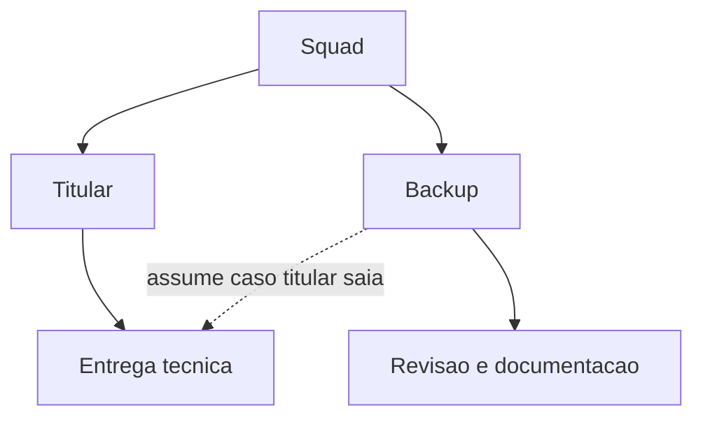
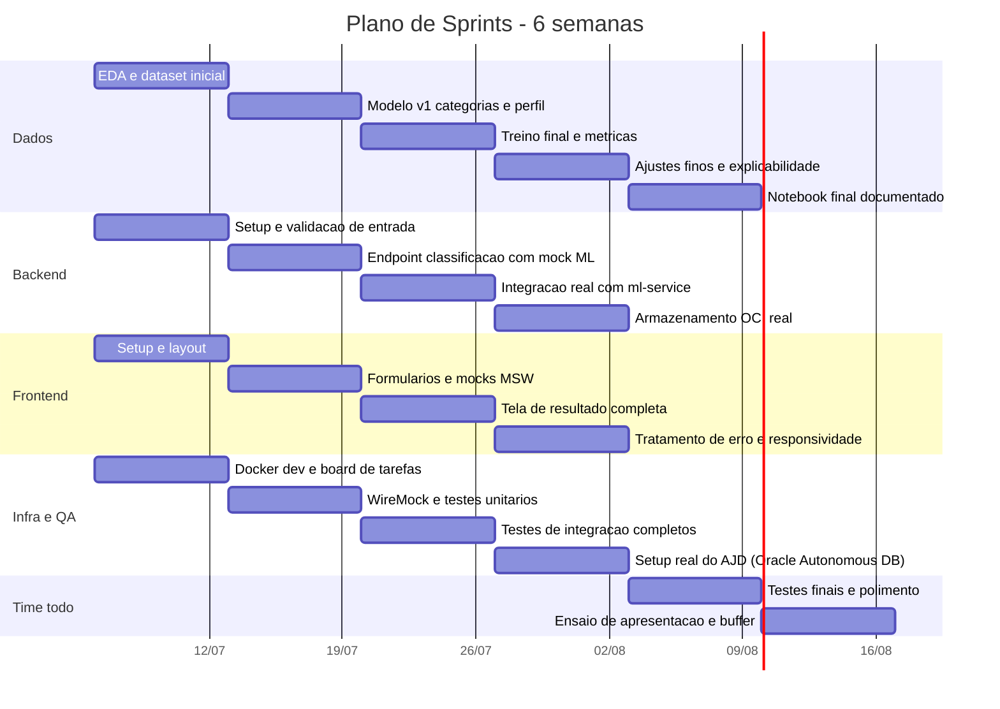
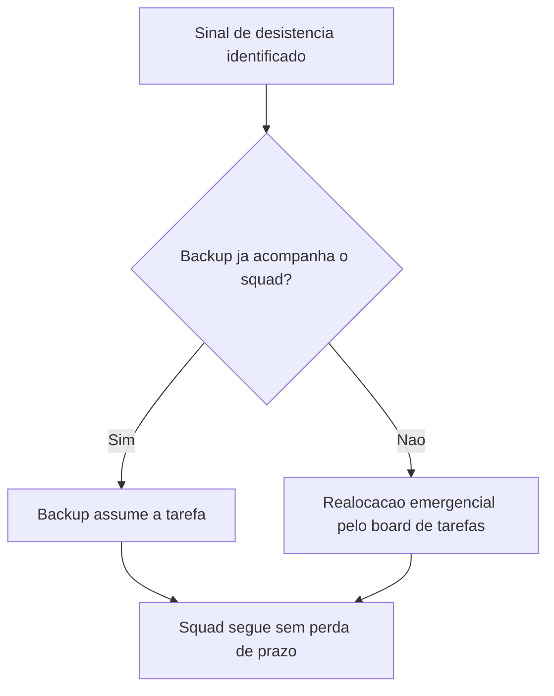

# Documentação de Sprints
## Sistema de Análise de Comportamento Financeiro e Recomendação Personalizada

---

## 1. Propósito deste Documento

Este documento define o plano de execução do projeto ao longo de 6 semanas, com 8 membros na equipe, considerando uma disponibilidade média de 1h por dia por pessoa. O plano assume que a equipe pode sofrer desistências ao longo do caminho e por isso organiza o trabalho em squads de duas pessoas, nunca em responsabilidades individuais isoladas.

---

## 2. Nota sobre Nomenclatura de Categoria

O edital original do hackathon usa a categoria "entretenimento" no exemplo de saída do endpoint `/analise-financeira`. A equipe optou por adotar o nome "Lazer" como categoria oficial no DICIONARIO.md e nos demais documentos do projeto. Essa adaptação é permitida pelo próprio edital, que autoriza a equipe a ajustar as categorias de despesa e de perfil conforme sua estratégia. Fica registrado aqui para eliminar qualquer dúvida de avaliador ao comparar a saída do sistema com o exemplo do enunciado.

---

## 3. Premissas de Capacidade

| Item | Valor considerado |
|---|---|
| Membros da equipe | 8 |
| Dedicação média por pessoa | 1h por dia útil |
| Capacidade semanal por pessoa | 5 a 7h |
| Capacidade semanal teórica do time | 40 a 56h |
| Capacidade semanal efetiva considerada no plano | 60% a 70% do teórico, por conta de troca de contexto, comunicação e imprevistos |
| Duração total | 6 semanas |

Como o tempo diário é curto, o plano prioriza squads de duas pessoas em vez de tarefas atribuídas a um único indivíduo. Isso reduz o risco de travar uma frente inteira caso alguém saia do projeto no meio do caminho.

---

## 4. Estrutura de Squads

| Squad | Responsabilidade principal | Documentos de referência |
|---|---|---|
| Dados | EDA, limpeza dos dados, engenharia de atributos, treino e avaliação dos modelos, serialização em `.pkl`, endpoint `/ml/analise` no FastAPI | REQUISITOS.md, DICIONARIO.md |
| Backend | API Spring Boot, validação de entrada, geração de recomendações, integração com o ml-service, implementação da interface de Armazenamento (local e OCI) | CONTRATOS.md, ARQUITETURA.md |
| Frontend | Páginas React, componentes, integração com a API, tratamento de erro e estados de carregamento | FRONTEND.md |
| Infra, QA e Documentação | Docker e docker compose, configuração real do serviço OCI, testes automatizados, consolidação da documentação e do board de tarefas | TESTES.md, este documento |

Cada squad define, na Sprint 1, um titular e um backup para a entrega principal. O backup participa das decisões desde o início, revisa o trabalho do titular e mantém a documentação markdown do squad atualizada. Se o titular sair do projeto, o backup assume sem precisar de repasse longo, porque já acompanhou o histórico de decisões.

---

## 5. Visão Geral do Cronograma

---

## 6. Detalhamento por Sprint

### Sprint 1, semana 1: Fundação

| Squad | Entregas da semana |
|---|---|
| Dados | Coleta ou geração do dataset, primeira limpeza, EDA inicial |
| Backend | Estrutura do projeto Spring Boot, DTOs, validação básica com Bean Validation |
| Frontend | Setup do Vite com TypeScript, roteamento, layout base |
| Infra e QA | Dockerfiles individuais, `docker-compose.yml` de desenvolvimento, board de tarefas com squads e responsáveis definidos |

Critério de saída da sprint: o ambiente sobe com `docker compose up`, mesmo sem a lógica de negócio pronta.

### Sprint 2, semana 2: Contratos e mocks

| Squad | Entregas da semana |
|---|---|
| Dados | Engenharia de atributos, primeira versão do modelo de classificação de transações |
| Backend | Endpoint `/classificacao-transacoes` funcional com regras simples, sem ML ainda, seguindo o catálogo de erros |
| Frontend | Componente `FormTransacoes`, tipos TypeScript, chamadas mockadas via MSW |
| Infra e QA | WireMock configurado, primeiros testes unitários no backend e no frontend |

Critério de saída da sprint: o fluxo de classificação de transações funciona de ponta a ponta com dados mockados.

### Sprint 3, semana 3: Integração real

| Squad | Entregas da semana |
|---|---|
| Dados | Treino e avaliação do modelo de perfil financeiro, serialização dos `.pkl`, endpoints `/ml/analise` e `/ml/health` no FastAPI |
| Backend | Chamada real ao ml-service, tratamento de timeout com código `SERVICO_ML_INDISPONIVEL`, geração de recomendações conforme a matriz do DICIONARIO.md |
| Frontend | Tela de resultado completa com os componentes `ResultadoPerfil`, `ResumoGastos` e `ListaRecomendacoes` |
| Infra e QA | Testes de integração reais com TestClient no ml-service e WireMock cobrindo os cenários de erro |

Critério de saída da sprint: o endpoint `/analise-financeira` funciona de ponta a ponta com o modelo real, sem mocks.

### Sprint 4, semana 4: OCI e persistência

| Squad | Entregas da semana |
|---|---|
| Backend | Implementação da interface de Armazenamento nos modos local e OCI, configuração das variáveis de ambiente |
| Infra e QA | Criação do Autonomous JSON Database real, download da wallet, teste manual de conexão via SODA |
| Dados | Ajuste fino do modelo com base nos testes reais, início da explicabilidade se houver tempo disponível |
| Frontend | Tratamento de erro no cliente, estados de carregamento, responsividade |

Critério de saída da sprint: a alternância entre `ARMAZENAMENTO_TIPO=local` e `autonomous_json` funciona de forma comprovada, não apenas codificada.

### Sprint 5, semana 5: Testes e consolidação

| Squad | Entregas da semana |
|---|---|
| Todos | Cobertura de testes automatizados completa, execução via `docker-compose.test.yml` |
| Dados | Notebook final documentado, com EDA, treino, métricas e serialização, pronto para entrega |
| Backend e Frontend | Correção de bugs identificados, revisão de experiência de uso |
| Infra e QA | Revisão do ambiente de produção com Nginx e proxy reverso, consolidação do README e da documentação |

Critério de saída da sprint: sistema estável, sem bugs bloqueantes, documentação de todos os artefatos atualizada.

### Sprint 6, semana 6: Fechamento

| Todos | Atividades da semana |
|---|---|
| Buffer para correções críticas de última hora |
| Validação final dos três ou mais exemplos reais de uso, de ponta a ponta |
| Demonstração real do modo OCI ativado, sem simulação |
| Ensaio da apresentação, roteiro do pitch, slides finais |

Critério de saída da sprint: MVP pronto, testado e ensaiado para a apresentação.

---

## 7. Mitigação de Risco de Desistência

1. Squads de duas pessoas, nunca responsabilidade individual isolada. Se um titular sair, o backup assume sem precisar de um repasse longo, porque acompanhou o trabalho desde o início.
2. Documentação viva obrigatória. Cada squad mantém um markdown descrevendo decisões técnicas e as razões das escolhas, reduzindo a dependência do conhecimento de uma única pessoa.
3. Check-in assíncrono duas vezes por semana. Cada squad relata o que foi feito, o que está bloqueado e o que falta, permitindo identificar sinais de desistência antes que virem crise.
4. Backlog priorizado por squad, não por pessoa, no board de tarefas, para que a realocação de uma tarefa não exija reorganizar todo o cronograma.
5. Escopo obrigatório protegido. Os itens opcionais, como dashboard, histórico, processamento em lote, exportação e explicabilidade, só entram na Sprint 4 ou 5 se o escopo obrigatório já estiver em dia. Eles são os primeiros a serem cortados em caso de perda de capacidade do time.

---

## 8. Matriz de Responsabilidades Resumida

| Entrega obrigatória do edital | Squad responsável | Sprint alvo |
|---|---|---|
| Classificação automática de despesas | Dados e Backend | Sprint 2 e 3 |
| Identificação de padrões de consumo | Dados | Sprint 2 |
| Classificação de perfil financeiro | Dados e Backend | Sprint 3 |
| Indicadores agregados | Backend | Sprint 3 |
| Recomendações personalizadas | Backend | Sprint 3 |
| Endpoint de análise financeira completa | Backend | Sprint 3 |
| Endpoint de classificação isolada | Backend | Sprint 2 |
| Validação de entrada e tratamento de erros | Backend | Sprint 1 e 2 |
| Documentação dos endpoints | Backend e Infra/QA | Sprint 1 a 5 |
| Integração com OCI | Backend e Infra/QA | Sprint 4 |
| Três ou mais exemplos reais de uso | Backend e Dados | Sprint 6 |
| Notebook de Ciência de Dados completo | Dados | Sprint 5 |

---
