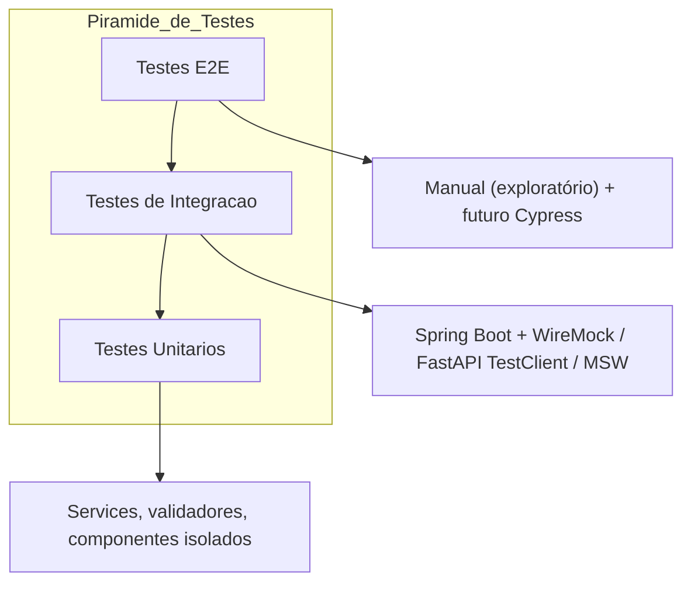
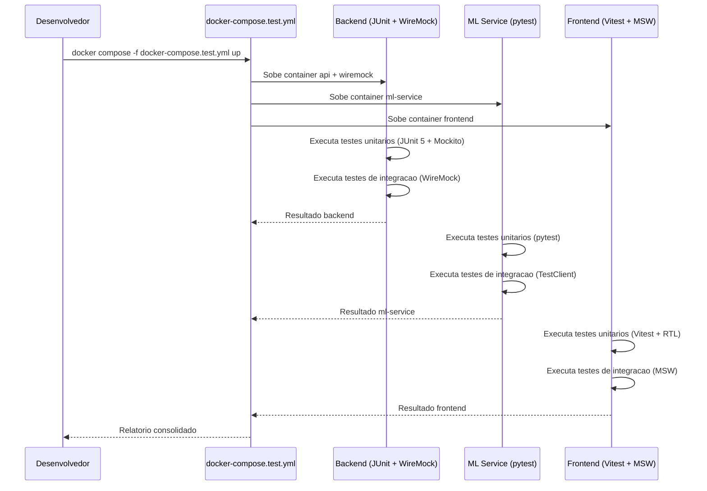

# Documentação de Testes

## Sistema de Análise de Comportamento Financeiro e Recomendação Personalizada

---

## 1. Estratégia Geral

Cada serviço possui sua própria suíte de testes, executada de forma isolada em container Docker. Nenhum teste depende de outro serviço rodando.

```
comando único:
docker compose -f docker-compose.test.yml up --abort-on-container-exit
```

### 1.1 Pirâmide de Testes



### 1.2 Fluxo de Execução dos Testes



---

## 2. Backend (Spring Boot) - JUnit 5 + Mockito + WireMock

### 2.1 Testes Unitários

Testam regras de negócio e validação de forma isolada, sem depender de outros componentes.

```java
class AnalisadorPerfilFinanceiroTest {
    @Test
    void dadoEndividamentoBaixoEPoupancaAlta_deveRetornarSaudavel() {
        var dados = new AnaliseFinanceiraRequest(
            8000,           // rendaMensal
            5,              // nivelEndividamento
            "Alta",         // frequenciaPoupanca
            List.of()       // transacoes
        );
        var perfil = analisador.classificar(dados);
        assertThat(perfil.getNome()).isEqualTo("Saudavel");
    }
}
```

**O que testar:**

| Classe | Cenário | Entrada | Saída Esperada |
|---|---|---|---|
| `AnalisadorPerfilFinanceiro` | Perfil saudável | Endividamento baixo, poupança alta, gastos equilibrados | "Saudavel" |
| `AnalisadorPerfilFinanceiro` | Perfil em observação | Endividamento moderado, poupança média | "Em observacao" |
| `AnalisadorPerfilFinanceiro` | Perfil em risco | Endividamento alto, poupança nenhuma, gastos altos em lazer | "Em risco" |
| `AnalisadorPerfilFinanceiro` | Probabilidade alta | Dados consistentes dentro de um perfil | >= 0.80 |
| `GeradorRecomendacoes` | Gasto elevado em lazer | Perfil "Em risco", lazer = 40% da renda | Recomendação: reduzir lazer |
| `GeradorRecomendacoes` | Perfil saudável | Endividamento baixo, poupança alta | Recomendação: manter padrão |
| `AnaliseValidator` | Valor de transação negativo | -10 | Erro VALOR_TRANSACAO_INVALIDO |
| `AnaliseValidator` | Descrição vazia | "" | Erro CAMPO_INVALIDO |
| `AnaliseValidator` | Endividamento > 100 | 150 | Erro CAMPO_INVALIDO |
| `AnaliseValidator` | Endividamento = 0 | 0 | Válido |
| `AnaliseValidator` | Endividamento = 100 (comprometimento total) | 100 | Valido (caso de fronteira, secao 8 DICIONARIO) |
| `AnaliseValidator` | transacoes[].valor = 0 | 0 | Erro VALOR_TRANSACAO_INVALIDO |
| `AnaliseValidator` | frequencia_poupanca com erro de digitacao | "Mediaa" | Erro ENUM_INVALIDO |
| `IdentificadorPadroesConsumo` | Descricao "Farmacia e Conveniencia" | - | Priorizar Saude (regra de desambiguacao 3.3) |
| `AnaliseValidator` | Transacoes com descricao duplicada | Lista ["Supermercado", "Supermercado"] | Cada uma validada e classificada independentemente |
| `IdentificadorPadroesConsumo` | Concentracao de categoria | Lazer = 40% do total gasto | PC001 presente |
| `IdentificadorPadroesConsumo` | Sem concentracao | Gastos distribuidas igualmente entre 4 categorias | Nenhum PC001 |
| `IdentificadorPadroesConsumo` | Gasto recorrente | Duas transacoes "Streaming" e "STREAMING " (normalizacao) | PC004 presente (uma vez) |
| `IdentificadorPadroesConsumo` | Transacao atipica | Uma transacao com valor 10x a media das demais | PC005 presente |
| `IdentificadorPadroesConsumo` | Comprometimento essencial alto | Moradia + Saude > 50% da renda | PC002 retornado com valor > 50% |

### 2.2 Testes de Integração (WireMock)

Testam o controller + service com o ml-service simulado via WireMock. Não depende do container Python.

```java
@SpringBootTest(webEnvironment = RandomPort)
@WireMockTest(httpPort = 8081)
class AnaliseFinanceiraControllerTest {

    @Test
    void deveRetornar200ComDadosValidos() {
        stubFor(post("/ml/analise").willReturn(okJson("""
            {
                "perfil_financeiro": "Saudavel",
                "probabilidade": 0.91,
                "transacoes_classificadas": [
                    {"descricao": "Aluguel", "valor": 1500, "categoria": "Moradia"}
                ]
            }
            """)));

        var response = restTemplate.postForEntity(
            "/analise-financeira", requisicaoValida(), String.class);

        assertThat(response.getStatusCode()).isEqualTo(200);
        // Validar corpo completo
    }

    @Test
    void deveRetornar422QuandoMLRetornaErro() {
        stubFor(post("/ml/analise")
            .willReturn(jsonResponse("{\"erro\": {...}}").withStatus(422)));

        var response = restTemplate.postForEntity(
            "/analise-financeira", requisicaoValida(), String.class);

        assertThat(response.getStatusCode()).isEqualTo(422);
    }

    @Test
    void deveRetornar400QuandoJsonInvalido() {
        var response = restTemplate.postForEntity(
            "/analise-financeira", "{{ json invalido", String.class);

        assertThat(response.getStatusCode()).isEqualTo(400);
    }
}
```

**Arquivos de mock (WireMock):**

```
backend/src/test/resources/wiremock/
├── ml-analise-saudavel.json
├── ml-analise-observacao.json
├── ml-analise-risco.json
├── ml-analise-erro-422.json
└── ml-analise-erro-500.json
```

### 2.3 Teste de Contrato (Opcional)

Um único teste que valida o contrato real entre Spring Boot e ml-service. Não roda no ciclo normal de testes.

```java
@Tag("contract")
class ContratoMLServiceTest {

    @Test
    void contratoComMLServiceDeveSerValido() {
        // Aponta para ml-service:8000 de verdade
        // Verifica se o contrato de entrada/saída é compatível
    }
}
```

Executado manualmente quando necessário:
```bash
mvn test -Dgroups=contract
```

---

## 3. ML Service (FastAPI) - pytest

### 3.1 Testes Unitários

Testam o carregamento dos modelos e a lógica de classificação.

```python
class TestClassificador:
    def test_classificar_alimentacao(self, modelo_transacoes):
        categoria = classificar("Supermercado", modelo_transacoes)
        assert categoria == "Alimentacao"

    def test_classificar_transporte(self, modelo_transacoes):
        categoria = classificar("Combustivel", modelo_transacoes)
        assert categoria == "Transporte"

    def test_classificar_outras(self, modelo_transacoes):
        categoria = classificar("Descricao desconhecida", modelo_transacoes)
        assert categoria == "Outras"

    def test_probabilidade_no_range(self, modelo_perfil):
        perfil, prob = classificar_perfil(
            renda=8000, endividamento=5, poupanca="Alta",
            transacoes=[], modelo_perfil=modelo_perfil
        )
        assert 0 <= prob <= 1
        assert perfil in ["Saudavel", "Em observacao", "Em risco"]
```

### 3.2 Testes de Integração (TestClient)

Testam o endpoint HTTP do ml-service sem precisar subir o servidor real.

```python
from fastapi.testclient import TestClient

class TestEndpointML:
    def test_analise_completa_saudavel(self, client):
        response = client.post("/ml/analise", json={
            "renda_mensal": 8000,
            "nivel_endividamento": 5,
            "frequencia_poupanca": "Alta",
            "transacoes": [
                {"descricao": "Aluguel", "valor": 1500},
                {"descricao": "Farmacia", "valor": 120}
            ]
        })
        assert response.status_code == 200
        data = response.json()
        assert "perfil_financeiro" in data
        assert "probabilidade" in data
        assert "transacoes_classificadas" in data

    def test_analise_sem_transacoes(self, client):
        response = client.post("/ml/analise", json={
            "renda_mensal": 8000,
            "nivel_endividamento": 5,
            "frequencia_poupanca": "Alta",
            "transacoes": []
        })
        assert response.status_code == 422

    def test_analise_valor_negativo(self, client):
        response = client.post("/ml/analise", json={
            "renda_mensal": 8000,
            "nivel_endividamento": 5,
            "frequencia_poupanca": "Alta",
            "transacoes": [{"descricao": "Teste", "valor": -100}]
        })
        assert response.status_code == 422
```

### 3.3 Fixtures

```python
@pytest.fixture
def modelo_transacoes():
    import joblib
    return joblib.load("models/modelo_transacoes.pkl")

@pytest.fixture
def modelo_perfil():
    import joblib
    return joblib.load("models/modelo_perfil.pkl")

@pytest.fixture
def client():
    from main import app
    return TestClient(app)
```

---

## 4. Frontend (React) - Vitest + React Testing Library + MSW

### 4.1 Testes Unitários (Componentes)

Testam componentes de forma isolada com props mockadas.

```tsx
describe("ResultadoPerfil", () => {
    it("exibe perfil Saudavel com probabilidade", () => {
        render(<ResultadoPerfil
            perfil="Saudavel"
            probabilidade={0.91}
        />);
        expect(screen.getByText("Saudavel")).toBeInTheDocument();
        expect(screen.getByText("91%")).toBeInTheDocument();
    });

    it("exibe a cor correta para cada perfil", () => {
        const { rerender } = render(<ResultadoPerfil perfil="Saudavel" probabilidade={0.9} />);
        expect(screen.getByTestId("card-perfil")).toHaveClass("perfil-saudavel");

        rerender(<ResultadoPerfil perfil="Em risco" probabilidade={0.8} />);
        expect(screen.getByTestId("card-perfil")).toHaveClass("perfil-risco");
    });
});

describe("FormTransacoes", () => {
    it("adiciona transacao na lista", () => {
        render(<FormTransacoes />);
        fireEvent.change(screen.getByPlaceholderText("Descrição"), {
            target: { value: "Supermercado" }
        });
        fireEvent.change(screen.getByPlaceholderText("Valor"), {
            target: { value: "420" }
        });
        fireEvent.click(screen.getByText("Adicionar"));
        expect(screen.getByText("Supermercado")).toBeInTheDocument();
    });

    it("mostra erro se descricao vazia", () => {
        render(<FormTransacoes />);
        fireEvent.change(screen.getByPlaceholderText("Valor"), {
            target: { value: "100" }
        });
        fireEvent.click(screen.getByText("Adicionar"));
        expect(screen.getByText("Descrição é obrigatória")).toBeInTheDocument();
    });
});
```

### 4.2 Testes de Integração (Páginas + MSW)

Testam o fluxo completo da página com a API mockada via MSW (Mock Service Worker).

```tsx
import { http, HttpResponse } from "msw";
import { setupServer } from "msw/node";

const server = setupServer(
    http.post("/api/analise-financeira", async ({ request }) => {
        return HttpResponse.json({
            perfil_financeiro: "Saudavel",
            probabilidade: 0.91,
            resumo_gastos: { moradia: 1500, saude: 120 },
            recomendacoes: ["Manter padrão atual de poupança"]
        });
    })
);

beforeAll(() => server.listen());
afterEach(() => server.resetHandlers());
afterAll(() => server.close());

describe("Pagina AnaliseFinanceira", () => {
    it("exibe resultado apos submeter formulario", async () => {
        render(<AnaliseFinanceira />);

        fireEvent.change(screen.getByLabelText("Renda Mensal"), {
            target: { value: "8000" }
        });
        fireEvent.click(screen.getByText("Analisar"));

        await screen.findByText("Saudavel");
        await screen.findByText("Manter padrão atual de poupança");
    });

    it("exibe erro quando API retorna 422", async () => {
        server.use(
            http.post("/api/analise-financeira", async ({ request }) => {
                return HttpResponse.json(
                    { erro: { codigo: "VALOR_TRANSACAO_INVALIDO", mensagem: "..." } },
                    { status: 422 }
                );
            })
        );

        render(<AnaliseFinanceira />);
        fireEvent.change(screen.getByLabelText("Renda Mensal"), {
            target: { value: "-100" }
        });
        fireEvent.click(screen.getByText("Analisar"));

        await screen.findByText("VALOR_TRANSACAO_INVALIDO");
    });
});
```

### 4.3 MSW Handlers

```
frontend/src/mocks/
├── handlers.ts
└── server.ts
```

```ts
// handlers.ts
import { http, HttpResponse } from "msw";

export const handlers = [
    http.post("/api/analise-financeira", async ({ request }) => {
        const body = await request.json() as AnaliseFinanceiraRequest;
        if (body.renda_mensal <= 0) {
            return HttpResponse.json(
                { erro: { codigo: "CAMPO_INVALIDO", campo: "renda_mensal" } },
                { status: 422 }
            );
        }
        return HttpResponse.json(analiseFinanceiraMock);
    }),
    http.post("/api/classificacao-transacoes", async () => {
        return HttpResponse.json(classificacaoMock);
    }),
];
```

---

## 5. docker-compose.test.yml

```yaml
services:
  ml-service:
    build:
      context: ./ml-service
      dockerfile: Dockerfile
    command: pytest tests/ -v --cov

  wiremock:
    image: wiremock/wiremock:latest
    volumes:
      - ./backend/src/test/resources/wiremock:/home/wiremock

  api:
    build:
      context: ./backend
      dockerfile: Dockerfile
    environment:
      - ML_SERVICE_URL=http://wiremock:8081
    command: mvn test
    depends_on:
      - wiremock

  frontend:
    build:
      context: ./frontend
      dockerfile: Dockerfile
    command: npx vitest run --coverage
```

### Como rodar

```bash
# Todos os testes
docker compose -f docker-compose.test.yml up --abort-on-container-exit

# Apenas backend
docker compose -f docker-compose.test.yml run api

# Apenas ml-service
docker compose -f docker-compose.test.yml run ml-service

# Apenas frontend
docker compose -f docker-compose.test.yml run frontend
```

---

## 6. Responsabilidades por Perfil

| Perfil | Testes que escreve | Ferramentas |
|---|---|---|
| Back-end (Java) | Unitários (service, validator) + Integração (controller + WireMock) | JUnit 5, Mockito, WireMock |
| Ciência de Dados (Python) | Unitários (modelos) + Integração (endpoint ml-service) | pytest, pytest-cov |
| Frontend (React) | Unitários (componentes) + Integração (páginas + MSW) | Vitest, React Testing Library, MSW |
| Qualquer membro | Roda a suíte completa com um comando | Docker |

---

## 7. Cenários de Erro que os Testes Devem Cobrir (WireMock)

| Cenário | Status HTTP | Mock |
|---|---|---|
| ml-service responde com sucesso | 200 | `okJson(...)` |
| ml-service retorna erro de validação | 422 | `jsonResponse(...).withStatus(422)` |
| ml-service retorna erro interno | 500 | `serverError()` |
| ml-service não responde (timeout) | 504 (Spring trata) | `temporalError()` |
| ml-service responde com JSON malformado | 500 | `ok("{{ invalido")` |
| ml-service responde com campos faltando | 500 | `okJson("{\"parcial\": true}")` |
